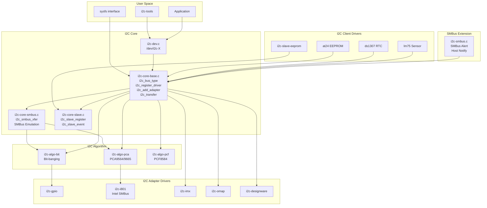
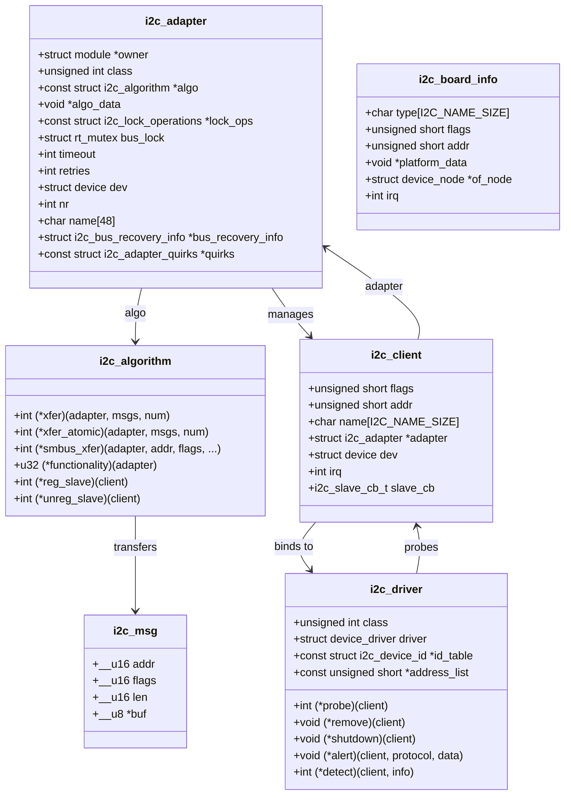
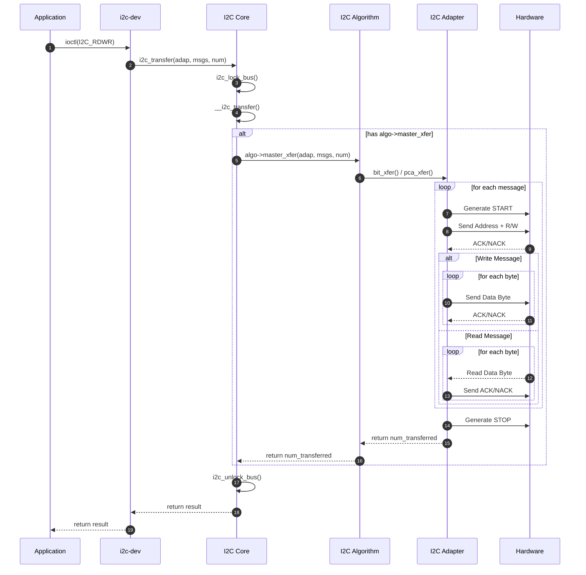
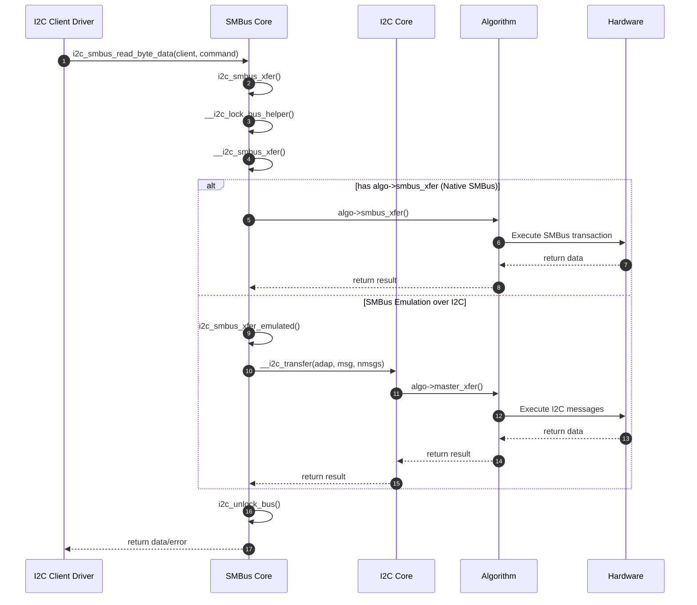
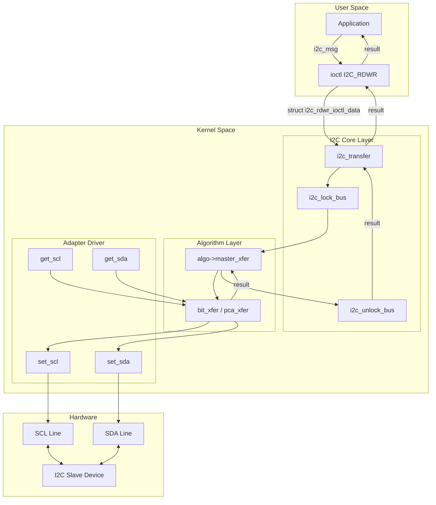
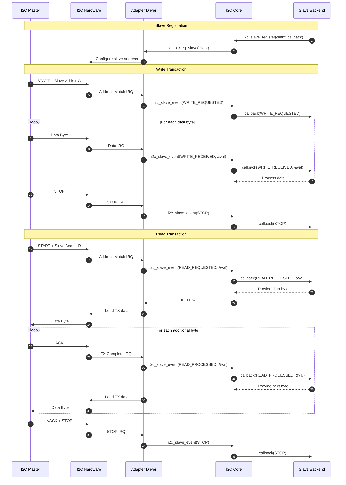
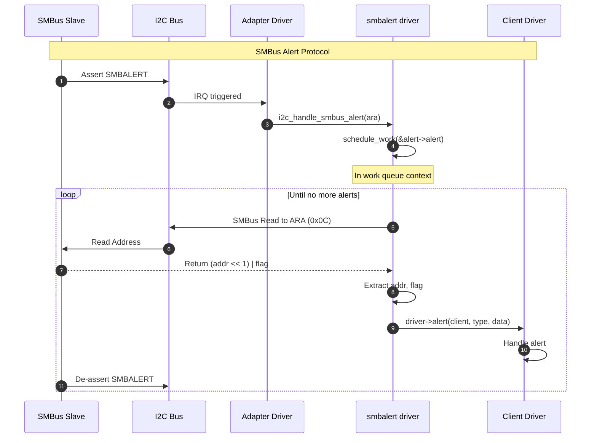

# Linux I2C子系统架构分析

> 基于Linux内核源码分析的I2C驱动架构文档

## 目录

1. [概述](#1-概述)
2. [模块关系图](#2-模块关系图)
3. [核心数据结构](#3-核心数据结构)
4. [模块详解](#4-模块详解)
5. [泳道图 - 主设备传输流程](#5-泳道图---主设备传输流程)
6. [数据流向图](#6-数据流向图)
7. [I2C Slave模式](#7-i2c-slave模式)
8. [SMBus支持](#8-smbus支持)
9. [代码示例](#9-代码示例)

---

## 1. 概述

Linux I2C子系统是一个分层架构，负责管理I2C总线和连接到该总线上的设备。该子系统主要由以下几部分组成：

| 组件 | 说明 | 主要文件 |
|------|------|----------|
| **I2C Core** | I2C核心层，提供统一的API和设备模型集成 | `i2c-core-base.c` |
| **I2C Adapter** | I2C适配器（控制器）驱动 | `drivers/i2c/busses/` |
| **I2C Algorithm** | I2C传输算法实现 | `drivers/i2c/algos/` |
| **I2C Client Driver** | I2C从设备驱动 | 各子系统中 |
| **SMBus** | SMBus协议支持和仿真 | `i2c-core-smbus.c`, `i2c-smbus.c` |
| **I2C Slave** | I2C从机模式支持 | `i2c-core-slave.c` |

---

## 2. 模块关系图

### 2.1 整体架构

```
┌─────────────────────────────────────────────────────────────────────────────┐
│                              User Space                                     │
│  ┌─────────────┐  ┌─────────────┐  ┌─────────────┐  ┌─────────────┐        │
│  │   i2c-tools │  │  Application │  │  i2cdetect  │  │  i2cget/set │        │
│  └──────┬──────┘  └──────┬──────┘  └──────┬──────┘  └──────┬──────┘        │
└─────────┼────────────────┼────────────────┼────────────────┼────────────────┘
          │                │                │                │
          │  /dev/i2c-X    │                │                │
          ▼                ▼                ▼                ▼
┌─────────────────────────────────────────────────────────────────────────────┐
│                              Kernel Space                                   │
│                                                                             │
│  ┌───────────────────────────────────────────────────────────────────────┐ │
│  │                        I2C Client Drivers                             │ │
│  │  ┌──────────┐  ┌──────────┐  ┌──────────┐  ┌──────────┐              │ │
│  │  │  EEPROM  │  │  Sensor  │  │   RTC    │  │  Codec   │  ...         │ │
│  │  │  Driver  │  │  Driver  │  │  Driver  │  │  Driver  │              │ │
│  │  └────┬─────┘  └────┬─────┘  └────┬─────┘  └────┬─────┘              │ │
│  └───────┼─────────────┼─────────────┼─────────────┼────────────────────┘ │
│          │             │             │             │                       │
│          ▼             ▼             ▼             ▼                       │
│  ┌───────────────────────────────────────────────────────────────────────┐ │
│  │                         I2C Core Layer                                │ │
│  │  ┌─────────────────┐  ┌─────────────────┐  ┌─────────────────────┐   │ │
│  │  │ i2c-core-base.c │  │ i2c-core-smbus.c│  │ i2c-core-slave.c    │   │ │
│  │  │                 │  │                 │  │                     │   │ │
│  │  │ - i2c_transfer  │  │ - SMBus xfer    │  │ - slave_register    │   │ │
│  │  │ - adapter mgmt  │  │ - SMBus emul    │  │ - slave_event       │   │ │
│  │  │ - client mgmt   │  │                 │  │                     │   │ │
│  │  └────────┬────────┘  └────────┬────────┘  └──────────┬──────────┘   │ │
│  └───────────┼────────────────────┼──────────────────────┼──────────────┘ │
│              │                    │                      │                 │
│              ▼                    ▼                      ▼                 │
│  ┌───────────────────────────────────────────────────────────────────────┐ │
│  │                      I2C Algorithm Layer                              │ │
│  │  ┌─────────────────┐  ┌─────────────────┐  ┌─────────────────┐       │ │
│  │  │  i2c-algo-bit   │  │  i2c-algo-pca   │  │  i2c-algo-pcf   │       │ │
│  │  │  (Bit-banging)  │  │  (PCA9564/9665) │  │  (PCF8584)      │       │ │
│  │  └────────┬────────┘  └────────┬────────┘  └────────┬────────┘       │ │
│  └───────────┼────────────────────┼────────────────────┼────────────────┘ │
│              │                    │                    │                   │
│              ▼                    ▼                    ▼                   │
│  ┌───────────────────────────────────────────────────────────────────────┐ │
│  │                      I2C Adapter (Controller) Drivers                 │ │
│  │  ┌──────────┐  ┌──────────┐  ┌──────────┐  ┌──────────┐  ┌────────┐ │ │
│  │  │ i2c-gpio │  │ i2c-i801 │  │i2c-bcm283│  │i2c-imx   │  │i2c-omap│ │ │
│  │  │ (GPIO)   │  │ (Intel)  │  │ (RPi)    │  │ (i.MX)   │  │        │ │ │
│  │  └────┬─────┘  └────┬─────┘  └────┬─────┘  └────┬─────┘  └───┬────┘ │ │
│  └───────┼─────────────┼─────────────┼─────────────┼────────────┼──────┘ │
│          │             │             │             │            │         │
└──────────┼─────────────┼─────────────┼─────────────┼────────────┼─────────┘
           │             │             │             │            │
           ▼             ▼             ▼             ▼            ▼
┌─────────────────────────────────────────────────────────────────────────────┐
│                              Hardware Layer                                 │
│  ┌──────────────────────────────────────────────────────────────────────┐  │
│  │                          I2C Bus (SCL/SDA)                           │  │
│  │  ┌──────────┐  ┌──────────┐  ┌──────────┐  ┌──────────┐              │  │
│  │  │  EEPROM  │  │  Sensor  │  │   RTC    │  │  Other   │              │  │
│  │  │  24C02   │  │  LM75    │  │  DS1307  │  │  Device  │              │  │
│  │  └──────────┘  └──────────┘  └──────────┘  └──────────┘              │  │
│  └──────────────────────────────────────────────────────────────────────┘  │
└─────────────────────────────────────────────────────────────────────────────┘
```

### 2.2 Mermaid模块关系图



---

## 3. 核心数据结构

### 3.1 主要结构体关系



### 3.2 关键结构体定义

#### i2c_adapter（I2C适配器/控制器）

```c
// include/linux/i2c.h
struct i2c_adapter {
    struct module *owner;
    unsigned int class;                 /* classes to allow probing for */
    const struct i2c_algorithm *algo;   /* the algorithm to access the bus */
    void *algo_data;

    const struct i2c_lock_operations *lock_ops;
    struct rt_mutex bus_lock;
    struct rt_mutex mux_lock;

    int timeout;                        /* in jiffies */
    int retries;
    struct device dev;                  /* the adapter device */
    int nr;
    char name[48];

    struct i2c_bus_recovery_info *bus_recovery_info;
    const struct i2c_adapter_quirks *quirks;
    struct irq_domain *host_notify_domain;
};
```

#### i2c_algorithm（I2C算法）

```c
// include/linux/i2c.h
struct i2c_algorithm {
    /* Transfer a given number of messages */
    int (*xfer)(struct i2c_adapter *adap, struct i2c_msg *msgs, int num);
    int (*xfer_atomic)(struct i2c_adapter *adap, struct i2c_msg *msgs, int num);

    /* SMBus transfers */
    int (*smbus_xfer)(struct i2c_adapter *adap, u16 addr,
                      unsigned short flags, char read_write,
                      u8 command, int size, union i2c_smbus_data *data);

    /* Return the bus functionality */
    u32 (*functionality)(struct i2c_adapter *adap);

    /* I2C Slave support */
    int (*reg_slave)(struct i2c_client *client);
    int (*unreg_slave)(struct i2c_client *client);
};
```

#### i2c_client（I2C从设备）

```c
// include/linux/i2c.h
struct i2c_client {
    unsigned short flags;       /* I2C_CLIENT_TEN, I2C_CLIENT_PEC, etc */
    unsigned short addr;        /* chip address - NOTE: 7bit */
    char name[I2C_NAME_SIZE];
    struct i2c_adapter *adapter;/* the adapter we sit on */
    struct device dev;          /* the device structure */
    int init_irq;               /* irq set at initialization */
    int irq;                    /* irq issued by device */
    struct list_head detected;
#if IS_ENABLED(CONFIG_I2C_SLAVE)
    i2c_slave_cb_t slave_cb;    /* callback for slave mode */
#endif
};
```

---

## 4. 模块详解

### 4.1 I2C Core (i2c-core-base.c)

I2C核心是整个I2C子系统的中枢，负责：

- **总线类型注册**：`i2c_bus_type`
- **适配器管理**：`i2c_add_adapter()`, `i2c_del_adapter()`
- **驱动注册**：`i2c_register_driver()`, `i2c_del_driver()`
- **设备管理**：`i2c_new_client_device()`, `i2c_unregister_device()`
- **数据传输**：`i2c_transfer()`, `__i2c_transfer()`

```c
// Key APIs in i2c-core-base.c

/* Register an I2C adapter */
int i2c_add_adapter(struct i2c_adapter *adapter);
int i2c_add_numbered_adapter(struct i2c_adapter *adap);

/* Register an I2C driver */
int i2c_register_driver(struct module *owner, struct i2c_driver *driver);

/* Create an I2C client device */
struct i2c_client *i2c_new_client_device(struct i2c_adapter *adap,
                                          struct i2c_board_info const *info);

/* Transfer I2C messages */
int i2c_transfer(struct i2c_adapter *adap, struct i2c_msg *msgs, int num);
```

### 4.2 I2C Algorithm

I2C算法层定义了如何在物理层面完成I2C传输。

#### 4.2.1 Bit-banging算法 (i2c-algo-bit.c)

通过软件控制GPIO引脚模拟I2C时序：

```c
// Key operations in i2c-algo-bit.c

/* Low-level bit operations */
static void i2c_start(struct i2c_algo_bit_data *adap);
static void i2c_repstart(struct i2c_algo_bit_data *adap);
static void i2c_stop(struct i2c_algo_bit_data *adap);

/* Byte transfer */
static int i2c_outb(struct i2c_adapter *i2c_adap, unsigned char c);
static int i2c_inb(struct i2c_adapter *i2c_adap);

/* Main transfer function */
static int bit_xfer(struct i2c_adapter *i2c_adap,
                    struct i2c_msg msgs[], int num);
```

#### 4.2.2 PCA算法 (i2c-algo-pca.c)

用于PCA9564/PCA9665硬件I2C控制器：

```c
// Key operations in i2c-algo-pca.c

static int pca_start(struct i2c_algo_pca_data *adap);
static void pca_stop(struct i2c_algo_pca_data *adap);
static int pca_address(struct i2c_algo_pca_data *adap, struct i2c_msg *msg);
static int pca_tx_byte(struct i2c_algo_pca_data *adap, __u8 b);
static void pca_rx_byte(struct i2c_algo_pca_data *adap, __u8 *b, int ack);

static int pca_xfer(struct i2c_adapter *i2c_adap,
                    struct i2c_msg *msgs, int num);
```

### 4.3 I2C Adapter驱动

适配器驱动是特定硬件控制器的实现。

#### 示例：i2c-gpio

```c
// drivers/i2c/busses/i2c-gpio.c

struct i2c_gpio_private_data {
    struct gpio_desc *sda;
    struct gpio_desc *scl;
    struct i2c_adapter adap;
    struct i2c_algo_bit_data bit_data;
    struct i2c_gpio_platform_data pdata;
};

/* Set SDA value */
static void i2c_gpio_setsda_val(void *data, int state)
{
    struct i2c_gpio_private_data *priv = data;
    gpiod_set_value_cansleep(priv->sda, state);
}

/* Set SCL value */
static void i2c_gpio_setscl_val(void *data, int state)
{
    struct i2c_gpio_private_data *priv = data;
    gpiod_set_value_cansleep(priv->scl, state);
}

/* Get SDA value */
static int i2c_gpio_getsda(void *data)
{
    struct i2c_gpio_private_data *priv = data;
    return gpiod_get_value_cansleep(priv->sda);
}
```

---

## 5. 泳道图 - 主设备传输流程

### 5.1 I2C传输流程



### 5.2 SMBus传输流程



---

## 6. 数据流向图

### 6.1 I2C写操作数据流

```
┌─────────────────────────────────────────────────────────────────────────────┐
│                            Write Data Flow                                  │
└─────────────────────────────────────────────────────────────────────────────┘

User Space                     Kernel Space                       Hardware
    │                              │                                   │
    │  struct i2c_msg {            │                                   │
    │    addr = 0x50               │                                   │
    │    flags = 0 (Write)         │                                   │
    │    len = 4                   │                                   │
    │    buf = [0x00, 0xAA, ...]   │                                   │
    │  }                           │                                   │
    │                              │                                   │
    ▼                              │                                   │
┌──────────┐                       │                                   │
│ /dev/i2c │ ──────────────────────┼───────────────────────────────────┤
└──────────┘                       │                                   │
    │                              │                                   │
    │  ioctl(I2C_RDWR, &data)      │                                   │
    │                              │                                   │
    ▼                              ▼                                   │
              ┌─────────────────────────────┐                          │
              │       I2C Core              │                          │
              │  i2c_transfer(adap, msgs)   │                          │
              └─────────────┬───────────────┘                          │
                            │                                          │
                            │  Lock bus, prepare transfer              │
                            │                                          │
                            ▼                                          │
              ┌─────────────────────────────┐                          │
              │     I2C Algorithm           │                          │
              │  algo->master_xfer()        │                          │
              └─────────────┬───────────────┘                          │
                            │                                          │
                            │  Generate I2C protocol                   │
                            │                                          │
                            ▼                                          ▼
              ┌─────────────────────────────┐        ┌────────────────────────┐
              │    I2C Adapter Driver       │        │      I2C Bus           │
              │  set_scl(), set_sda()       │───────▶│  ┌────────────────┐    │
              └─────────────────────────────┘        │  │ START          │    │
                                                     │  │ Addr(0x50)+W   │    │
                                                     │  │ ACK            │    │
                                                     │  │ Data[0]: 0x00  │    │
                                                     │  │ ACK            │    │
                                                     │  │ Data[1]: 0xAA  │    │
                                                     │  │ ACK            │    │
                                                     │  │ ...            │    │
                                                     │  │ STOP           │    │
                                                     │  └────────────────┘    │
                                                     └────────────────────────┘
```

### 6.2 I2C读操作数据流

```
┌─────────────────────────────────────────────────────────────────────────────┐
│                            Read Data Flow                                   │
└─────────────────────────────────────────────────────────────────────────────┘

Hardware                       Kernel Space                      User Space
    │                              │                                   │
    │                              │                                   │
    ▼                              │                                   │
┌──────────────────────────┐       │                                   │
│       I2C Bus            │       │                                   │
│  ┌────────────────┐      │       │                                   │
│  │ START          │      │       │                                   │
│  │ Addr(0x50)+R   │      │       │                                   │
│  │ ACK            │      │       │                                   │
│  │ Data[0]: 0xDE  │◀─────┼───────┤  ← Slave sends data               │
│  │ ACK            │      │       │                                   │
│  │ Data[1]: 0xAD  │◀─────┼───────┤                                   │
│  │ NACK           │      │       │                                   │
│  │ STOP           │      │       │                                   │
│  └────────────────┘      │       │                                   │
└──────────┬───────────────┘       │                                   │
           │                       │                                   │
           ▼                       │                                   │
┌─────────────────────────────┐    │                                   │
│    I2C Adapter Driver       │    │                                   │
│  get_sda() returns data     │    │                                   │
└─────────────┬───────────────┘    │                                   │
              │                    │                                   │
              │  Raw bytes         │                                   │
              │                    │                                   │
              ▼                    │                                   │
┌─────────────────────────────┐    │                                   │
│     I2C Algorithm           │    │                                   │
│  Assemble i2c_msg.buf       │    │                                   │
└─────────────┬───────────────┘    │                                   │
              │                    │                                   │
              │  i2c_msg with data │                                   │
              │                    │                                   │
              ▼                    │                                   │
┌─────────────────────────────┐    │                                   │
│       I2C Core              │    │                                   │
│  Return from i2c_transfer() │    │                                   │
└─────────────┬───────────────┘    │                                   │
              │                    │                                   │
              │                    │                                   │
              ▼                    ▼                                   ▼
                            ┌──────────┐                        ┌──────────┐
                            │ /dev/i2c │───────────────────────▶│ App gets │
                            └──────────┘  copy_to_user()        │ data buf │
                                                                └──────────┘
```

### 6.3 Mermaid数据流图



---

## 7. I2C Slave模式

### 7.1 Slave模式架构

```
┌─────────────────────────────────────────────────────────────────────────────┐
│                         I2C Slave Mode Architecture                         │
└─────────────────────────────────────────────────────────────────────────────┘

                    ┌─────────────────────────────────┐
                    │     I2C Slave Backend Driver    │
                    │     (e.g., i2c-slave-eeprom)    │
                    │                                 │
                    │  +---------------------------+  │
                    │  | i2c_slave_eeprom_slave_cb |  │
                    │  | (Callback Function)       |  │
                    │  +---------------------------+  │
                    └───────────────┬─────────────────┘
                                    │
                                    │ i2c_slave_register(client, callback)
                                    │
                                    ▼
                    ┌─────────────────────────────────┐
                    │     I2C Core - Slave Support    │
                    │     (i2c-core-slave.c)          │
                    │                                 │
                    │  i2c_slave_register()           │
                    │  i2c_slave_unregister()         │
                    │  i2c_slave_event()              │
                    └───────────────┬─────────────────┘
                                    │
                                    │ algo->reg_slave(client)
                                    │
                                    ▼
                    ┌─────────────────────────────────┐
                    │     I2C Adapter Driver          │
                    │     (with slave support)        │
                    │                                 │
                    │  +---------------------------+  │
                    │  | reg_slave()               |  │
                    │  | unreg_slave()             |  │
                    │  | Handle HW interrupts      |  │
                    │  +---------------------------+  │
                    └───────────────┬─────────────────┘
                                    │
                                    │ Hardware Interrupts
                                    │
                                    ▼
                    ┌─────────────────────────────────┐
                    │        I2C Hardware             │
                    │                                 │
                    │   Acts as Slave on the bus      │
                    │   Responds to Master requests   │
                    └─────────────────────────────────┘
```

### 7.2 Slave事件类型

```c
// include/linux/i2c.h
enum i2c_slave_event {
    I2C_SLAVE_READ_REQUESTED,   /* Master wants to read, first byte */
    I2C_SLAVE_WRITE_REQUESTED,  /* Master wants to write, first byte incoming */
    I2C_SLAVE_READ_PROCESSED,   /* Master read previous byte, send next */
    I2C_SLAVE_WRITE_RECEIVED,   /* Master sent a byte */
    I2C_SLAVE_STOP,             /* STOP condition detected */
};
```

### 7.3 Slave模式泳道图



---

## 8. SMBus支持

### 8.1 SMBus协议类型

| 协议类型 | 描述 | 数据大小 |
|----------|------|----------|
| `I2C_SMBUS_QUICK` | Quick Command | 0 bits |
| `I2C_SMBUS_BYTE` | Send/Receive Byte | 1 byte |
| `I2C_SMBUS_BYTE_DATA` | Read/Write Byte Data | 1 byte |
| `I2C_SMBUS_WORD_DATA` | Read/Write Word Data | 2 bytes |
| `I2C_SMBUS_PROC_CALL` | Process Call | 2 bytes |
| `I2C_SMBUS_BLOCK_DATA` | Block Read/Write | Up to 32 bytes |
| `I2C_SMBUS_I2C_BLOCK_DATA` | I2C Block Data | Up to 32 bytes |
| `I2C_SMBUS_BLOCK_PROC_CALL` | Block Process Call | Up to 32 bytes |

### 8.2 SMBus实现层次

```
┌─────────────────────────────────────────────────────────────────────────────┐
│                         SMBus Implementation                                │
└─────────────────────────────────────────────────────────────────────────────┘

┌─────────────────────────────────────────────────────────────────────────────┐
│                          Client Driver APIs                                 │
│  i2c_smbus_read_byte()    i2c_smbus_write_byte()                           │
│  i2c_smbus_read_byte_data()   i2c_smbus_write_byte_data()                  │
│  i2c_smbus_read_word_data()   i2c_smbus_write_word_data()                  │
│  i2c_smbus_read_block_data()  i2c_smbus_write_block_data()                 │
└───────────────────────────────────┬─────────────────────────────────────────┘
                                    │
                                    ▼
┌─────────────────────────────────────────────────────────────────────────────┐
│                    i2c_smbus_xfer() (i2c-core-smbus.c)                     │
│                                                                             │
│  1. Lock bus                                                                │
│  2. Call __i2c_smbus_xfer()                                                │
│  3. Unlock bus                                                              │
└───────────────────────────────────┬─────────────────────────────────────────┘
                                    │
                    ┌───────────────┴───────────────┐
                    │                               │
                    ▼                               ▼
    ┌───────────────────────────┐   ┌───────────────────────────┐
    │   Native SMBus Support    │   │   SMBus Emulation         │
    │                           │   │                           │
    │   algo->smbus_xfer()      │   │   i2c_smbus_xfer_emulated │
    │                           │   │                           │
    │   Used when adapter has   │   │   Converts SMBus calls    │
    │   hardware SMBus support  │   │   to I2C messages         │
    │   (e.g., i2c-i801)        │   │                           │
    └───────────────────────────┘   └─────────────┬─────────────┘
                                                  │
                                                  ▼
                                    ┌───────────────────────────┐
                                    │   __i2c_transfer()        │
                                    │                           │
                                    │   Uses standard I2C       │
                                    │   message transfer        │
                                    └───────────────────────────┘
```

### 8.3 SMBus Alert机制



---

## 9. 代码示例

### 9.1 简单I2C Client驱动

```c
#include <linux/module.h>
#include <linux/i2c.h>

static int my_i2c_probe(struct i2c_client *client)
{
    u8 buf[2];
    int ret;
    
    /* Read 2 bytes from register 0x00 */
    buf[0] = 0x00;  /* Register address */
    ret = i2c_master_send(client, buf, 1);
    if (ret < 0)
        return ret;
    
    ret = i2c_master_recv(client, buf, 2);
    if (ret < 0)
        return ret;
    
    dev_info(&client->dev, "Read: 0x%02x 0x%02x\n", buf[0], buf[1]);
    
    /* Alternative: use SMBus API */
    ret = i2c_smbus_read_byte_data(client, 0x00);
    if (ret < 0)
        return ret;
    
    dev_info(&client->dev, "SMBus Read: 0x%02x\n", ret);
    
    return 0;
}

static void my_i2c_remove(struct i2c_client *client)
{
    dev_info(&client->dev, "Device removed\n");
}

static const struct i2c_device_id my_i2c_id[] = {
    { "my-i2c-device", 0 },
    { }
};
MODULE_DEVICE_TABLE(i2c, my_i2c_id);

static const struct of_device_id my_i2c_of_match[] = {
    { .compatible = "vendor,my-i2c-device" },
    { }
};
MODULE_DEVICE_TABLE(of, my_i2c_of_match);

static struct i2c_driver my_i2c_driver = {
    .driver = {
        .name = "my-i2c-driver",
        .of_match_table = my_i2c_of_match,
    },
    .probe = my_i2c_probe,
    .remove = my_i2c_remove,
    .id_table = my_i2c_id,
};

module_i2c_driver(my_i2c_driver);

MODULE_LICENSE("GPL");
MODULE_AUTHOR("Author");
MODULE_DESCRIPTION("Simple I2C Client Driver Example");
```

### 9.2 I2C Adapter驱动框架

```c
#include <linux/module.h>
#include <linux/i2c.h>
#include <linux/platform_device.h>

struct my_i2c_adapter {
    struct i2c_adapter adap;
    void __iomem *base;
    /* Add hardware-specific fields */
};

static int my_i2c_xfer(struct i2c_adapter *adap,
                       struct i2c_msg *msgs, int num)
{
    struct my_i2c_adapter *priv = i2c_get_adapdata(adap);
    int i, ret;
    
    for (i = 0; i < num; i++) {
        struct i2c_msg *msg = &msgs[i];
        
        /* Generate START condition */
        /* ... hardware specific code ... */
        
        /* Send address */
        /* ... hardware specific code ... */
        
        if (msg->flags & I2C_M_RD) {
            /* Read data */
            /* ... hardware specific code ... */
        } else {
            /* Write data */
            /* ... hardware specific code ... */
        }
    }
    
    /* Generate STOP condition */
    /* ... hardware specific code ... */
    
    return num;  /* Return number of messages transferred */
}

static u32 my_i2c_functionality(struct i2c_adapter *adap)
{
    return I2C_FUNC_I2C | I2C_FUNC_SMBUS_EMUL;
}

static const struct i2c_algorithm my_i2c_algo = {
    .master_xfer = my_i2c_xfer,
    .functionality = my_i2c_functionality,
};

static int my_i2c_probe(struct platform_device *pdev)
{
    struct my_i2c_adapter *priv;
    int ret;
    
    priv = devm_kzalloc(&pdev->dev, sizeof(*priv), GFP_KERNEL);
    if (!priv)
        return -ENOMEM;
    
    priv->adap.owner = THIS_MODULE;
    priv->adap.algo = &my_i2c_algo;
    priv->adap.dev.parent = &pdev->dev;
    priv->adap.dev.of_node = pdev->dev.of_node;
    snprintf(priv->adap.name, sizeof(priv->adap.name), "my-i2c");
    
    i2c_set_adapdata(&priv->adap, priv);
    platform_set_drvdata(pdev, priv);
    
    ret = i2c_add_adapter(&priv->adap);
    if (ret)
        return ret;
    
    return 0;
}

static int my_i2c_remove(struct platform_device *pdev)
{
    struct my_i2c_adapter *priv = platform_get_drvdata(pdev);
    
    i2c_del_adapter(&priv->adap);
    return 0;
}

static const struct of_device_id my_i2c_of_match[] = {
    { .compatible = "vendor,my-i2c" },
    { }
};
MODULE_DEVICE_TABLE(of, my_i2c_of_match);

static struct platform_driver my_i2c_driver = {
    .probe = my_i2c_probe,
    .remove = my_i2c_remove,
    .driver = {
        .name = "my-i2c",
        .of_match_table = my_i2c_of_match,
    },
};

module_platform_driver(my_i2c_driver);

MODULE_LICENSE("GPL");
MODULE_AUTHOR("Author");
MODULE_DESCRIPTION("I2C Adapter Driver Framework Example");
```

### 9.3 I2C Slave后端驱动

```c
#include <linux/module.h>
#include <linux/i2c.h>

struct my_slave_data {
    u8 buffer[256];
    u8 buffer_idx;
};

static int my_slave_cb(struct i2c_client *client,
                       enum i2c_slave_event event, u8 *val)
{
    struct my_slave_data *data = i2c_get_clientdata(client);
    
    switch (event) {
    case I2C_SLAVE_WRITE_REQUESTED:
        data->buffer_idx = 0;
        break;
        
    case I2C_SLAVE_WRITE_RECEIVED:
        if (data->buffer_idx < sizeof(data->buffer))
            data->buffer[data->buffer_idx++] = *val;
        break;
        
    case I2C_SLAVE_READ_REQUESTED:
        *val = data->buffer[data->buffer_idx];
        break;
        
    case I2C_SLAVE_READ_PROCESSED:
        data->buffer_idx++;
        break;
        
    case I2C_SLAVE_STOP:
        data->buffer_idx = 0;
        break;
    }
    
    return 0;
}

static int my_slave_probe(struct i2c_client *client)
{
    struct my_slave_data *data;
    int ret;
    
    data = devm_kzalloc(&client->dev, sizeof(*data), GFP_KERNEL);
    if (!data)
        return -ENOMEM;
    
    i2c_set_clientdata(client, data);
    
    ret = i2c_slave_register(client, my_slave_cb);
    if (ret)
        return ret;
    
    return 0;
}

static void my_slave_remove(struct i2c_client *client)
{
    i2c_slave_unregister(client);
}

static const struct i2c_device_id my_slave_id[] = {
    { "my-slave", 0 },
    { }
};
MODULE_DEVICE_TABLE(i2c, my_slave_id);

static struct i2c_driver my_slave_driver = {
    .driver = {
        .name = "my-slave",
    },
    .probe = my_slave_probe,
    .remove = my_slave_remove,
    .id_table = my_slave_id,
};

module_i2c_driver(my_slave_driver);

MODULE_LICENSE("GPL");
MODULE_AUTHOR("Author");
MODULE_DESCRIPTION("I2C Slave Backend Driver Example");
```

---

## 附录A：关键源文件位置

| 文件 | 路径 | 描述 |
|------|------|------|
| I2C头文件 | `include/linux/i2c.h` | 主要数据结构和API定义 |
| I2C核心 | `drivers/i2c/i2c-core-base.c` | 核心功能实现 |
| SMBus核心 | `drivers/i2c/i2c-core-smbus.c` | SMBus协议支持 |
| Slave支持 | `drivers/i2c/i2c-core-slave.c` | I2C从机模式 |
| 内部头文件 | `drivers/i2c/i2c-core.h` | 内部使用的定义 |
| Bit-bang算法 | `drivers/i2c/algos/i2c-algo-bit.c` | GPIO bit-banging |
| PCA算法 | `drivers/i2c/algos/i2c-algo-pca.c` | PCA9564/9665 |
| GPIO适配器 | `drivers/i2c/busses/i2c-gpio.c` | GPIO I2C适配器 |
| Intel SMBus | `drivers/i2c/busses/i2c-i801.c` | Intel SMBus控制器 |
| DesignWare | `drivers/i2c/busses/i2c-designware-*.c` | Synopsys DesignWare |
| Slave EEPROM | `drivers/i2c/i2c-slave-eeprom.c` | EEPROM模拟器 |
| SMBus扩展 | `drivers/i2c/i2c-smbus.c` | SMBus Alert等 |

---

## 附录B：参考资料

1. Linux Kernel Documentation: `Documentation/i2c/`
2. I2C Specification: [NXP I2C-bus specification](https://www.nxp.com/docs/en/user-guide/UM10204.pdf)
3. SMBus Specification: [System Management Bus Specification](http://smbus.org/specs/)
4. Linux Device Drivers, 3rd Edition - Chapter 14: The Linux Device Model

---

*文档基于 Linux 内核源码分析生成*
*最后更新: 2026-01-06*
