# Linux I2C子系统架构分析

> 基于Linux内核源码分析的I2C驱动架构文档

## 目录

1. [概述](#1-概述)
2. [模块关系图](#2-模块关系图)
3. [核心数据结构](#3-核心数据结构)
4. [模块详解](#4-模块详解)
5. [泳道图 - 主设备传输流程](#5-泳道图---主设备传输流程)
6. [数据流向图](#6-数据流向图)
7. [I2C Slave模式](#7-i2c-slave模式)
8. [SMBus支持](#8-smbus支持)
9. [代码示例](#9-代码示例)
10. [I2C算法详解 - Bit-Banging](#10-i2c算法详解---bit-banging)
11. [I2C Adapter驱动详解 - 树莓派BCM2835](#11-i2c-adapter驱动详解---树莓派bcm2835)
12. [算法与适配器对比总结](#12-算法与适配器对比总结)

---

## 1. 概述

Linux I2C子系统是一个分层架构，负责管理I2C总线和连接到该总线上的设备。该子系统主要由以下几部分组成：

| 组件 | 说明 | 主要文件 |
|------|------|----------|
| **I2C Core** | I2C核心层，提供统一的API和设备模型集成 | `i2c-core-base.c` |
| **I2C Adapter** | I2C适配器（控制器）驱动 | `drivers/i2c/busses/` |
| **I2C Algorithm** | I2C传输算法实现 | `drivers/i2c/algos/` |
| **I2C Client Driver** | I2C从设备驱动 | 各子系统中 |
| **SMBus** | SMBus协议支持和仿真 | `i2c-core-smbus.c`, `i2c-smbus.c` |
| **I2C Slave** | I2C从机模式支持 | `i2c-core-slave.c` |

---

## 2. 模块关系图

### 2.1 整体架构

```
┌─────────────────────────────────────────────────────────────────────────────┐
│                              User Space                                     │
│  ┌─────────────┐  ┌─────────────┐  ┌─────────────┐  ┌─────────────┐        │
│  │   i2c-tools │  │  Application │  │  i2cdetect  │  │  i2cget/set │        │
│  └──────┬──────┘  └──────┬──────┘  └──────┬──────┘  └──────┬──────┘        │
└─────────┼────────────────┼────────────────┼────────────────┼────────────────┘
          │                │                │                │
          │  /dev/i2c-X    │                │                │
          ▼                ▼                ▼                ▼
┌─────────────────────────────────────────────────────────────────────────────┐
│                              Kernel Space                                   │
│                                                                             │
│  ┌───────────────────────────────────────────────────────────────────────┐ │
│  │                        I2C Client Drivers                             │ │
│  │  ┌──────────┐  ┌──────────┐  ┌──────────┐  ┌──────────┐              │ │
│  │  │  EEPROM  │  │  Sensor  │  │   RTC    │  │  Codec   │  ...         │ │
│  │  │  Driver  │  │  Driver  │  │  Driver  │  │  Driver  │              │ │
│  │  └────┬─────┘  └────┬─────┘  └────┬─────┘  └────┬─────┘              │ │
│  └───────┼─────────────┼─────────────┼─────────────┼────────────────────┘ │
│          │             │             │             │                       │
│          ▼             ▼             ▼             ▼                       │
│  ┌───────────────────────────────────────────────────────────────────────┐ │
│  │                         I2C Core Layer                                │ │
│  │  ┌─────────────────┐  ┌─────────────────┐  ┌─────────────────────┐   │ │
│  │  │ i2c-core-base.c │  │ i2c-core-smbus.c│  │ i2c-core-slave.c    │   │ │
│  │  │                 │  │                 │  │                     │   │ │
│  │  │ - i2c_transfer  │  │ - SMBus xfer    │  │ - slave_register    │   │ │
│  │  │ - adapter mgmt  │  │ - SMBus emul    │  │ - slave_event       │   │ │
│  │  │ - client mgmt   │  │                 │  │                     │   │ │
│  │  └────────┬────────┘  └────────┬────────┘  └──────────┬──────────┘   │ │
│  └───────────┼────────────────────┼──────────────────────┼──────────────┘ │
│              │                    │                      │                 │
│              ▼                    ▼                      ▼                 │
│  ┌───────────────────────────────────────────────────────────────────────┐ │
│  │                      I2C Algorithm Layer                              │ │
│  │  ┌─────────────────┐  ┌─────────────────┐  ┌─────────────────┐       │ │
│  │  │  i2c-algo-bit   │  │  i2c-algo-pca   │  │  i2c-algo-pcf   │       │ │
│  │  │  (Bit-banging)  │  │  (PCA9564/9665) │  │  (PCF8584)      │       │ │
│  │  └────────┬────────┘  └────────┬────────┘  └────────┬────────┘       │ │
│  └───────────┼────────────────────┼────────────────────┼────────────────┘ │
│              │                    │                    │                   │
│              ▼                    ▼                    ▼                   │
│  ┌───────────────────────────────────────────────────────────────────────┐ │
│  │                      I2C Adapter (Controller) Drivers                 │ │
│  │  ┌──────────┐  ┌──────────┐  ┌──────────┐  ┌──────────┐  ┌────────┐ │ │
│  │  │ i2c-gpio │  │ i2c-i801 │  │i2c-bcm283│  │i2c-imx   │  │i2c-omap│ │ │
│  │  │ (GPIO)   │  │ (Intel)  │  │ (RPi)    │  │ (i.MX)   │  │        │ │ │
│  │  └────┬─────┘  └────┬─────┘  └────┬─────┘  └────┬─────┘  └───┬────┘ │ │
│  └───────┼─────────────┼─────────────┼─────────────┼────────────┼──────┘ │
│          │             │             │             │            │         │
└──────────┼─────────────┼─────────────┼─────────────┼────────────┼─────────┘
           │             │             │             │            │
           ▼             ▼             ▼             ▼            ▼
┌─────────────────────────────────────────────────────────────────────────────┐
│                              Hardware Layer                                 │
│  ┌──────────────────────────────────────────────────────────────────────┐  │
│  │                          I2C Bus (SCL/SDA)                           │  │
│  │  ┌──────────┐  ┌──────────┐  ┌──────────┐  ┌──────────┐              │  │
│  │  │  EEPROM  │  │  Sensor  │  │   RTC    │  │  Other   │              │  │
│  │  │  24C02   │  │  LM75    │  │  DS1307  │  │  Device  │              │  │
│  │  └──────────┘  └──────────┘  └──────────┘  └──────────┘              │  │
│  └──────────────────────────────────────────────────────────────────────┘  │
└─────────────────────────────────────────────────────────────────────────────┘
```

### 2.2 Mermaid模块关系图

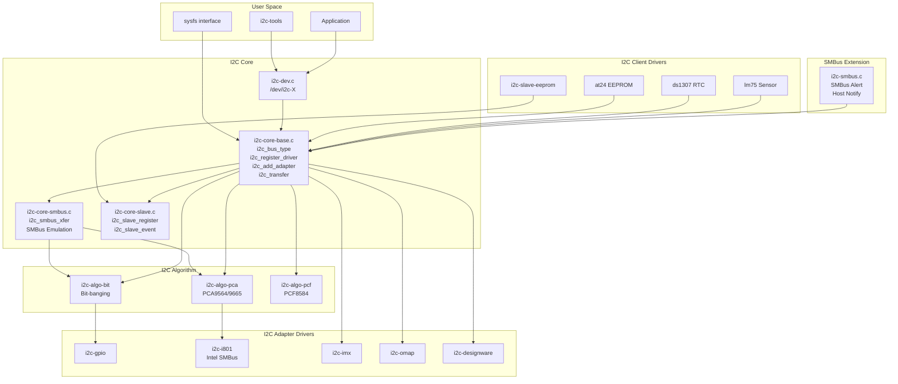

---

## 3. 核心数据结构

### 3.1 主要结构体关系

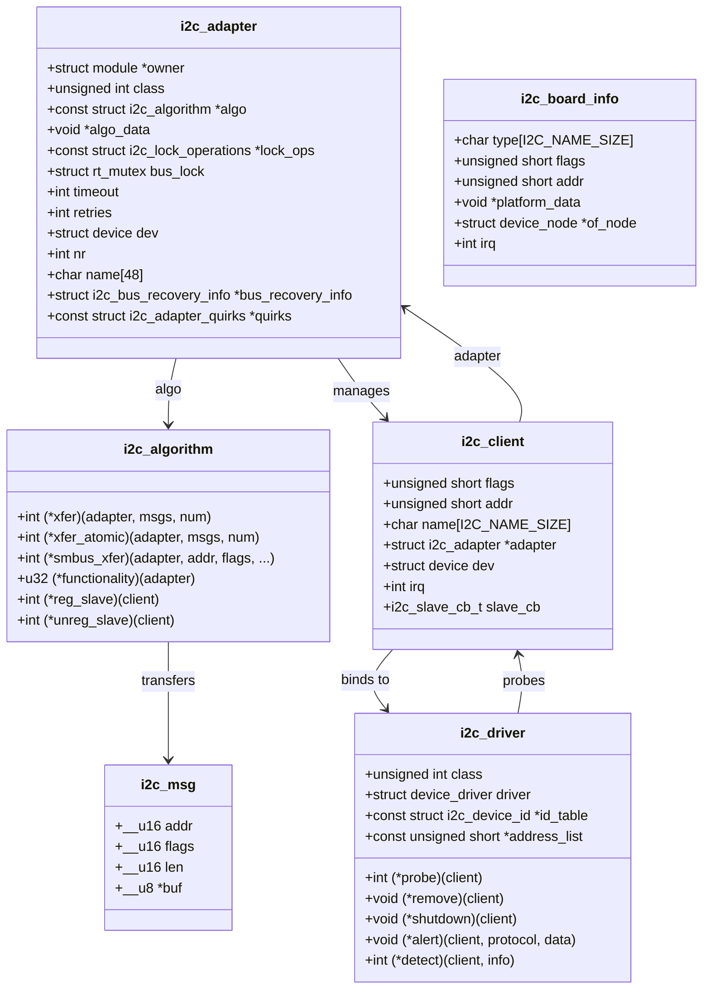

### 3.2 关键结构体定义

#### i2c_adapter（I2C适配器/控制器）

```c
// include/linux/i2c.h
struct i2c_adapter {
    struct module *owner;
    unsigned int class;                 /* classes to allow probing for */
    const struct i2c_algorithm *algo;   /* the algorithm to access the bus */
    void *algo_data;

    const struct i2c_lock_operations *lock_ops;
    struct rt_mutex bus_lock;
    struct rt_mutex mux_lock;

    int timeout;                        /* in jiffies */
    int retries;
    struct device dev;                  /* the adapter device */
    int nr;
    char name[48];

    struct i2c_bus_recovery_info *bus_recovery_info;
    const struct i2c_adapter_quirks *quirks;
    struct irq_domain *host_notify_domain;
};
```

#### i2c_algorithm（I2C算法）

```c
// include/linux/i2c.h
struct i2c_algorithm {
    /* Transfer a given number of messages */
    int (*xfer)(struct i2c_adapter *adap, struct i2c_msg *msgs, int num);
    int (*xfer_atomic)(struct i2c_adapter *adap, struct i2c_msg *msgs, int num);

    /* SMBus transfers */
    int (*smbus_xfer)(struct i2c_adapter *adap, u16 addr,
                      unsigned short flags, char read_write,
                      u8 command, int size, union i2c_smbus_data *data);

    /* Return the bus functionality */
    u32 (*functionality)(struct i2c_adapter *adap);

    /* I2C Slave support */
    int (*reg_slave)(struct i2c_client *client);
    int (*unreg_slave)(struct i2c_client *client);
};
```

#### i2c_client（I2C从设备）

```c
// include/linux/i2c.h
struct i2c_client {
    unsigned short flags;       /* I2C_CLIENT_TEN, I2C_CLIENT_PEC, etc */
    unsigned short addr;        /* chip address - NOTE: 7bit */
    char name[I2C_NAME_SIZE];
    struct i2c_adapter *adapter;/* the adapter we sit on */
    struct device dev;          /* the device structure */
    int init_irq;               /* irq set at initialization */
    int irq;                    /* irq issued by device */
    struct list_head detected;
#if IS_ENABLED(CONFIG_I2C_SLAVE)
    i2c_slave_cb_t slave_cb;    /* callback for slave mode */
#endif
};
```

---

## 4. 模块详解

### 4.1 I2C Core (i2c-core-base.c)

I2C核心是整个I2C子系统的中枢，负责：

- **总线类型注册**：`i2c_bus_type`
- **适配器管理**：`i2c_add_adapter()`, `i2c_del_adapter()`
- **驱动注册**：`i2c_register_driver()`, `i2c_del_driver()`
- **设备管理**：`i2c_new_client_device()`, `i2c_unregister_device()`
- **数据传输**：`i2c_transfer()`, `__i2c_transfer()`

```c
// Key APIs in i2c-core-base.c

/* Register an I2C adapter */
int i2c_add_adapter(struct i2c_adapter *adapter);
int i2c_add_numbered_adapter(struct i2c_adapter *adap);

/* Register an I2C driver */
int i2c_register_driver(struct module *owner, struct i2c_driver *driver);

/* Create an I2C client device */
struct i2c_client *i2c_new_client_device(struct i2c_adapter *adap,
                                          struct i2c_board_info const *info);

/* Transfer I2C messages */
int i2c_transfer(struct i2c_adapter *adap, struct i2c_msg *msgs, int num);
```

### 4.2 I2C Algorithm

I2C算法层定义了如何在物理层面完成I2C传输。

#### 4.2.1 Bit-banging算法 (i2c-algo-bit.c)

通过软件控制GPIO引脚模拟I2C时序：

```c
// Key operations in i2c-algo-bit.c

/* Low-level bit operations */
static void i2c_start(struct i2c_algo_bit_data *adap);
static void i2c_repstart(struct i2c_algo_bit_data *adap);
static void i2c_stop(struct i2c_algo_bit_data *adap);

/* Byte transfer */
static int i2c_outb(struct i2c_adapter *i2c_adap, unsigned char c);
static int i2c_inb(struct i2c_adapter *i2c_adap);

/* Main transfer function */
static int bit_xfer(struct i2c_adapter *i2c_adap,
                    struct i2c_msg msgs[], int num);
```

#### 4.2.2 PCA算法 (i2c-algo-pca.c)

用于PCA9564/PCA9665硬件I2C控制器：

```c
// Key operations in i2c-algo-pca.c

static int pca_start(struct i2c_algo_pca_data *adap);
static void pca_stop(struct i2c_algo_pca_data *adap);
static int pca_address(struct i2c_algo_pca_data *adap, struct i2c_msg *msg);
static int pca_tx_byte(struct i2c_algo_pca_data *adap, __u8 b);
static void pca_rx_byte(struct i2c_algo_pca_data *adap, __u8 *b, int ack);

static int pca_xfer(struct i2c_adapter *i2c_adap,
                    struct i2c_msg *msgs, int num);
```

### 4.3 I2C Adapter驱动

适配器驱动是特定硬件控制器的实现。

#### 示例：i2c-gpio

```c
// drivers/i2c/busses/i2c-gpio.c

struct i2c_gpio_private_data {
    struct gpio_desc *sda;
    struct gpio_desc *scl;
    struct i2c_adapter adap;
    struct i2c_algo_bit_data bit_data;
    struct i2c_gpio_platform_data pdata;
};

/* Set SDA value */
static void i2c_gpio_setsda_val(void *data, int state)
{
    struct i2c_gpio_private_data *priv = data;
    gpiod_set_value_cansleep(priv->sda, state);
}

/* Set SCL value */
static void i2c_gpio_setscl_val(void *data, int state)
{
    struct i2c_gpio_private_data *priv = data;
    gpiod_set_value_cansleep(priv->scl, state);
}

/* Get SDA value */
static int i2c_gpio_getsda(void *data)
{
    struct i2c_gpio_private_data *priv = data;
    return gpiod_get_value_cansleep(priv->sda);
}
```

---

## 5. 泳道图 - 主设备传输流程

### 5.1 I2C传输流程

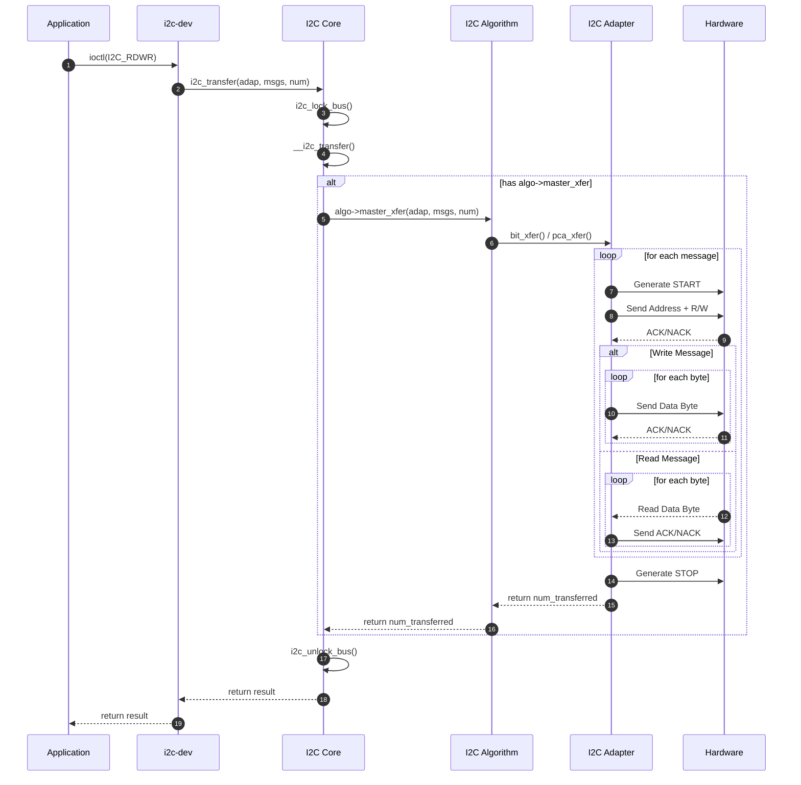

### 5.2 SMBus传输流程

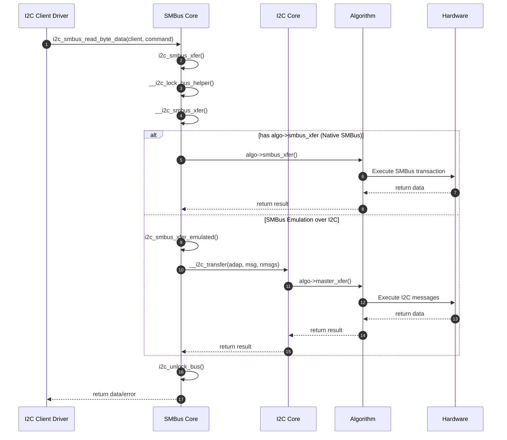

---

## 6. 数据流向图

### 6.1 I2C写操作数据流

```
┌─────────────────────────────────────────────────────────────────────────────┐
│                            Write Data Flow                                  │
└─────────────────────────────────────────────────────────────────────────────┘

User Space                     Kernel Space                       Hardware
    │                              │                                   │
    │  struct i2c_msg {            │                                   │
    │    addr = 0x50               │                                   │
    │    flags = 0 (Write)         │                                   │
    │    len = 4                   │                                   │
    │    buf = [0x00, 0xAA, ...]   │                                   │
    │  }                           │                                   │
    │                              │                                   │
    ▼                              │                                   │
┌──────────┐                       │                                   │
│ /dev/i2c │ ──────────────────────┼───────────────────────────────────┤
└──────────┘                       │                                   │
    │                              │                                   │
    │  ioctl(I2C_RDWR, &data)      │                                   │
    │                              │                                   │
    ▼                              ▼                                   │
              ┌─────────────────────────────┐                          │
              │       I2C Core              │                          │
              │  i2c_transfer(adap, msgs)   │                          │
              └─────────────┬───────────────┘                          │
                            │                                          │
                            │  Lock bus, prepare transfer              │
                            │                                          │
                            ▼                                          │
              ┌─────────────────────────────┐                          │
              │     I2C Algorithm           │                          │
              │  algo->master_xfer()        │                          │
              └─────────────┬───────────────┘                          │
                            │                                          │
                            │  Generate I2C protocol                   │
                            │                                          │
                            ▼                                          ▼
              ┌─────────────────────────────┐        ┌────────────────────────┐
              │    I2C Adapter Driver       │        │      I2C Bus           │
              │  set_scl(), set_sda()       │───────▶│  ┌────────────────┐    │
              └─────────────────────────────┘        │  │ START          │    │
                                                     │  │ Addr(0x50)+W   │    │
                                                     │  │ ACK            │    │
                                                     │  │ Data[0]: 0x00  │    │
                                                     │  │ ACK            │    │
                                                     │  │ Data[1]: 0xAA  │    │
                                                     │  │ ACK            │    │
                                                     │  │ ...            │    │
                                                     │  │ STOP           │    │
                                                     │  └────────────────┘    │
                                                     └────────────────────────┘
```

### 6.2 I2C读操作数据流

```
┌─────────────────────────────────────────────────────────────────────────────┐
│                            Read Data Flow                                   │
└─────────────────────────────────────────────────────────────────────────────┘

Hardware                       Kernel Space                      User Space
    │                              │                                   │
    │                              │                                   │
    ▼                              │                                   │
┌──────────────────────────┐       │                                   │
│       I2C Bus            │       │                                   │
│  ┌────────────────┐      │       │                                   │
│  │ START          │      │       │                                   │
│  │ Addr(0x50)+R   │      │       │                                   │
│  │ ACK            │      │       │                                   │
│  │ Data[0]: 0xDE  │◀─────┼───────┤  ← Slave sends data               │
│  │ ACK            │      │       │                                   │
│  │ Data[1]: 0xAD  │◀─────┼───────┤                                   │
│  │ NACK           │      │       │                                   │
│  │ STOP           │      │       │                                   │
│  └────────────────┘      │       │                                   │
└──────────┬───────────────┘       │                                   │
           │                       │                                   │
           ▼                       │                                   │
┌─────────────────────────────┐    │                                   │
│    I2C Adapter Driver       │    │                                   │
│  get_sda() returns data     │    │                                   │
└─────────────┬───────────────┘    │                                   │
              │                    │                                   │
              │  Raw bytes         │                                   │
              │                    │                                   │
              ▼                    │                                   │
┌─────────────────────────────┐    │                                   │
│     I2C Algorithm           │    │                                   │
│  Assemble i2c_msg.buf       │    │                                   │
└─────────────┬───────────────┘    │                                   │
              │                    │                                   │
              │  i2c_msg with data │                                   │
              │                    │                                   │
              ▼                    │                                   │
┌─────────────────────────────┐    │                                   │
│       I2C Core              │    │                                   │
│  Return from i2c_transfer() │    │                                   │
└─────────────┬───────────────┘    │                                   │
              │                    │                                   │
              │                    │                                   │
              ▼                    ▼                                   ▼
                            ┌──────────┐                        ┌──────────┐
                            │ /dev/i2c │───────────────────────▶│ App gets │
                            └──────────┘  copy_to_user()        │ data buf │
                                                                └──────────┘
```

### 6.3 Mermaid数据流图

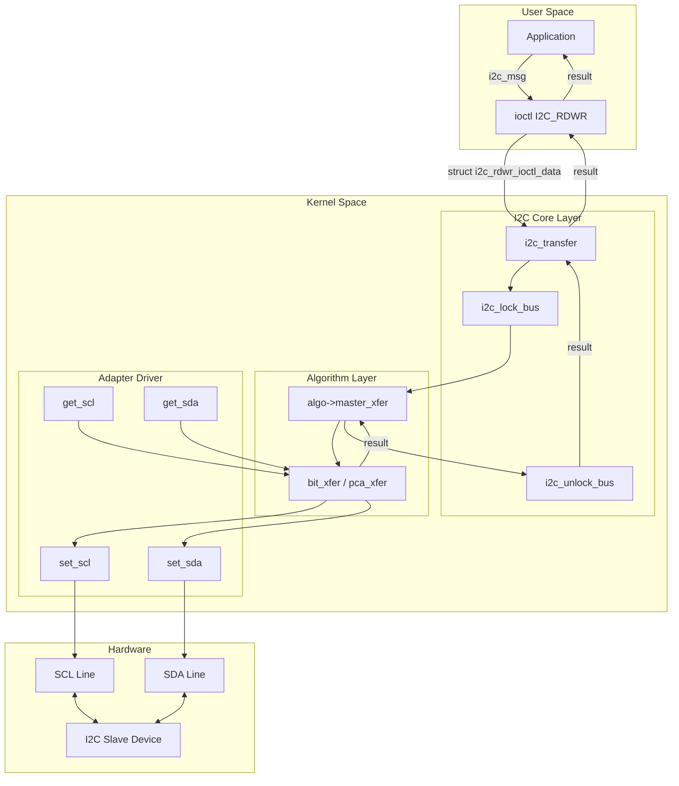

---

## 7. I2C Slave模式

### 7.1 Slave模式架构

```
┌─────────────────────────────────────────────────────────────────────────────┐
│                         I2C Slave Mode Architecture                         │
└─────────────────────────────────────────────────────────────────────────────┘

                    ┌─────────────────────────────────┐
                    │     I2C Slave Backend Driver    │
                    │     (e.g., i2c-slave-eeprom)    │
                    │                                 │
                    │  +---------------------------+  │
                    │  | i2c_slave_eeprom_slave_cb |  │
                    │  | (Callback Function)       |  │
                    │  +---------------------------+  │
                    └───────────────┬─────────────────┘
                                    │
                                    │ i2c_slave_register(client, callback)
                                    │
                                    ▼
                    ┌─────────────────────────────────┐
                    │     I2C Core - Slave Support    │
                    │     (i2c-core-slave.c)          │
                    │                                 │
                    │  i2c_slave_register()           │
                    │  i2c_slave_unregister()         │
                    │  i2c_slave_event()              │
                    └───────────────┬─────────────────┘
                                    │
                                    │ algo->reg_slave(client)
                                    │
                                    ▼
                    ┌─────────────────────────────────┐
                    │     I2C Adapter Driver          │
                    │     (with slave support)        │
                    │                                 │
                    │  +---------------------------+  │
                    │  | reg_slave()               |  │
                    │  | unreg_slave()             |  │
                    │  | Handle HW interrupts      |  │
                    │  +---------------------------+  │
                    └───────────────┬─────────────────┘
                                    │
                                    │ Hardware Interrupts
                                    │
                                    ▼
                    ┌─────────────────────────────────┐
                    │        I2C Hardware             │
                    │                                 │
                    │   Acts as Slave on the bus      │
                    │   Responds to Master requests   │
                    └─────────────────────────────────┘
```

### 7.2 Slave事件类型

```c
// include/linux/i2c.h
enum i2c_slave_event {
    I2C_SLAVE_READ_REQUESTED,   /* Master wants to read, first byte */
    I2C_SLAVE_WRITE_REQUESTED,  /* Master wants to write, first byte incoming */
    I2C_SLAVE_READ_PROCESSED,   /* Master read previous byte, send next */
    I2C_SLAVE_WRITE_RECEIVED,   /* Master sent a byte */
    I2C_SLAVE_STOP,             /* STOP condition detected */
};
```

### 7.3 Slave模式泳道图

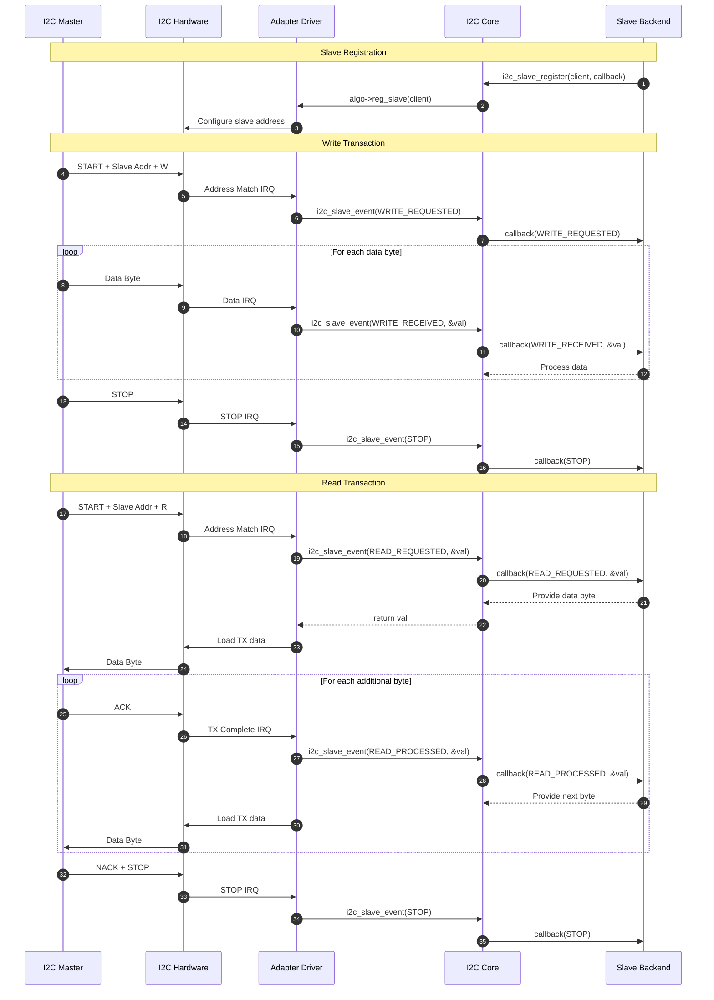

---

## 8. SMBus支持

### 8.1 SMBus协议类型

| 协议类型 | 描述 | 数据大小 |
|----------|------|----------|
| `I2C_SMBUS_QUICK` | Quick Command | 0 bits |
| `I2C_SMBUS_BYTE` | Send/Receive Byte | 1 byte |
| `I2C_SMBUS_BYTE_DATA` | Read/Write Byte Data | 1 byte |
| `I2C_SMBUS_WORD_DATA` | Read/Write Word Data | 2 bytes |
| `I2C_SMBUS_PROC_CALL` | Process Call | 2 bytes |
| `I2C_SMBUS_BLOCK_DATA` | Block Read/Write | Up to 32 bytes |
| `I2C_SMBUS_I2C_BLOCK_DATA` | I2C Block Data | Up to 32 bytes |
| `I2C_SMBUS_BLOCK_PROC_CALL` | Block Process Call | Up to 32 bytes |

### 8.2 SMBus实现层次

```
┌─────────────────────────────────────────────────────────────────────────────┐
│                         SMBus Implementation                                │
└─────────────────────────────────────────────────────────────────────────────┘

┌─────────────────────────────────────────────────────────────────────────────┐
│                          Client Driver APIs                                 │
│  i2c_smbus_read_byte()    i2c_smbus_write_byte()                           │
│  i2c_smbus_read_byte_data()   i2c_smbus_write_byte_data()                  │
│  i2c_smbus_read_word_data()   i2c_smbus_write_word_data()                  │
│  i2c_smbus_read_block_data()  i2c_smbus_write_block_data()                 │
└───────────────────────────────────┬─────────────────────────────────────────┘
                                    │
                                    ▼
┌─────────────────────────────────────────────────────────────────────────────┐
│                    i2c_smbus_xfer() (i2c-core-smbus.c)                     │
│                                                                             │
│  1. Lock bus                                                                │
│  2. Call __i2c_smbus_xfer()                                                │
│  3. Unlock bus                                                              │
└───────────────────────────────────┬─────────────────────────────────────────┘
                                    │
                    ┌───────────────┴───────────────┐
                    │                               │
                    ▼                               ▼
    ┌───────────────────────────┐   ┌───────────────────────────┐
    │   Native SMBus Support    │   │   SMBus Emulation         │
    │                           │   │                           │
    │   algo->smbus_xfer()      │   │   i2c_smbus_xfer_emulated │
    │                           │   │                           │
    │   Used when adapter has   │   │   Converts SMBus calls    │
    │   hardware SMBus support  │   │   to I2C messages         │
    │   (e.g., i2c-i801)        │   │                           │
    └───────────────────────────┘   └─────────────┬─────────────┘
                                                  │
                                                  ▼
                                    ┌───────────────────────────┐
                                    │   __i2c_transfer()        │
                                    │                           │
                                    │   Uses standard I2C       │
                                    │   message transfer        │
                                    └───────────────────────────┘
```

### 8.3 SMBus Alert机制

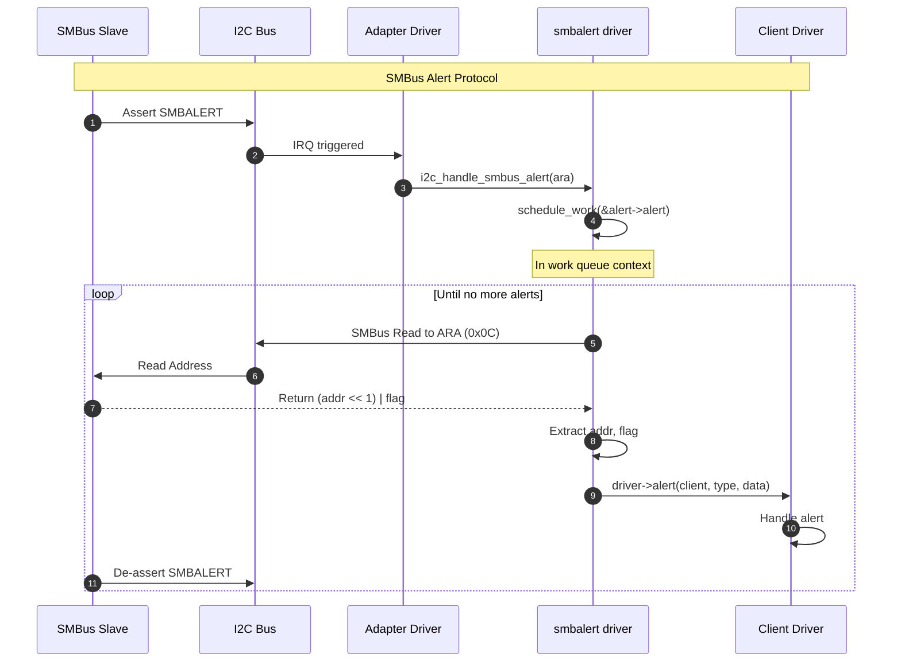

---

## 9. 代码示例

### 9.1 简单I2C Client驱动

```c
#include <linux/module.h>
#include <linux/i2c.h>

static int my_i2c_probe(struct i2c_client *client)
{
    u8 buf[2];
    int ret;
    
    /* Read 2 bytes from register 0x00 */
    buf[0] = 0x00;  /* Register address */
    ret = i2c_master_send(client, buf, 1);
    if (ret < 0)
        return ret;
    
    ret = i2c_master_recv(client, buf, 2);
    if (ret < 0)
        return ret;
    
    dev_info(&client->dev, "Read: 0x%02x 0x%02x\n", buf[0], buf[1]);
    
    /* Alternative: use SMBus API */
    ret = i2c_smbus_read_byte_data(client, 0x00);
    if (ret < 0)
        return ret;
    
    dev_info(&client->dev, "SMBus Read: 0x%02x\n", ret);
    
    return 0;
}

static void my_i2c_remove(struct i2c_client *client)
{
    dev_info(&client->dev, "Device removed\n");
}

static const struct i2c_device_id my_i2c_id[] = {
    { "my-i2c-device", 0 },
    { }
};
MODULE_DEVICE_TABLE(i2c, my_i2c_id);

static const struct of_device_id my_i2c_of_match[] = {
    { .compatible = "vendor,my-i2c-device" },
    { }
};
MODULE_DEVICE_TABLE(of, my_i2c_of_match);

static struct i2c_driver my_i2c_driver = {
    .driver = {
        .name = "my-i2c-driver",
        .of_match_table = my_i2c_of_match,
    },
    .probe = my_i2c_probe,
    .remove = my_i2c_remove,
    .id_table = my_i2c_id,
};

module_i2c_driver(my_i2c_driver);

MODULE_LICENSE("GPL");
MODULE_AUTHOR("Author");
MODULE_DESCRIPTION("Simple I2C Client Driver Example");
```

### 9.2 I2C Adapter驱动框架

```c
#include <linux/module.h>
#include <linux/i2c.h>
#include <linux/platform_device.h>

struct my_i2c_adapter {
    struct i2c_adapter adap;
    void __iomem *base;
    /* Add hardware-specific fields */
};

static int my_i2c_xfer(struct i2c_adapter *adap,
                       struct i2c_msg *msgs, int num)
{
    struct my_i2c_adapter *priv = i2c_get_adapdata(adap);
    int i, ret;
    
    for (i = 0; i < num; i++) {
        struct i2c_msg *msg = &msgs[i];
        
        /* Generate START condition */
        /* ... hardware specific code ... */
        
        /* Send address */
        /* ... hardware specific code ... */
        
        if (msg->flags & I2C_M_RD) {
            /* Read data */
            /* ... hardware specific code ... */
        } else {
            /* Write data */
            /* ... hardware specific code ... */
        }
    }
    
    /* Generate STOP condition */
    /* ... hardware specific code ... */
    
    return num;  /* Return number of messages transferred */
}

static u32 my_i2c_functionality(struct i2c_adapter *adap)
{
    return I2C_FUNC_I2C | I2C_FUNC_SMBUS_EMUL;
}

static const struct i2c_algorithm my_i2c_algo = {
    .master_xfer = my_i2c_xfer,
    .functionality = my_i2c_functionality,
};

static int my_i2c_probe(struct platform_device *pdev)
{
    struct my_i2c_adapter *priv;
    int ret;
    
    priv = devm_kzalloc(&pdev->dev, sizeof(*priv), GFP_KERNEL);
    if (!priv)
        return -ENOMEM;
    
    priv->adap.owner = THIS_MODULE;
    priv->adap.algo = &my_i2c_algo;
    priv->adap.dev.parent = &pdev->dev;
    priv->adap.dev.of_node = pdev->dev.of_node;
    snprintf(priv->adap.name, sizeof(priv->adap.name), "my-i2c");
    
    i2c_set_adapdata(&priv->adap, priv);
    platform_set_drvdata(pdev, priv);
    
    ret = i2c_add_adapter(&priv->adap);
    if (ret)
        return ret;
    
    return 0;
}

static int my_i2c_remove(struct platform_device *pdev)
{
    struct my_i2c_adapter *priv = platform_get_drvdata(pdev);
    
    i2c_del_adapter(&priv->adap);
    return 0;
}

static const struct of_device_id my_i2c_of_match[] = {
    { .compatible = "vendor,my-i2c" },
    { }
};
MODULE_DEVICE_TABLE(of, my_i2c_of_match);

static struct platform_driver my_i2c_driver = {
    .probe = my_i2c_probe,
    .remove = my_i2c_remove,
    .driver = {
        .name = "my-i2c",
        .of_match_table = my_i2c_of_match,
    },
};

module_platform_driver(my_i2c_driver);

MODULE_LICENSE("GPL");
MODULE_AUTHOR("Author");
MODULE_DESCRIPTION("I2C Adapter Driver Framework Example");
```

### 9.3 I2C Slave后端驱动

```c
#include <linux/module.h>
#include <linux/i2c.h>

struct my_slave_data {
    u8 buffer[256];
    u8 buffer_idx;
};

static int my_slave_cb(struct i2c_client *client,
                       enum i2c_slave_event event, u8 *val)
{
    struct my_slave_data *data = i2c_get_clientdata(client);
    
    switch (event) {
    case I2C_SLAVE_WRITE_REQUESTED:
        data->buffer_idx = 0;
        break;
        
    case I2C_SLAVE_WRITE_RECEIVED:
        if (data->buffer_idx < sizeof(data->buffer))
            data->buffer[data->buffer_idx++] = *val;
        break;
        
    case I2C_SLAVE_READ_REQUESTED:
        *val = data->buffer[data->buffer_idx];
        break;
        
    case I2C_SLAVE_READ_PROCESSED:
        data->buffer_idx++;
        break;
        
    case I2C_SLAVE_STOP:
        data->buffer_idx = 0;
        break;
    }
    
    return 0;
}

static int my_slave_probe(struct i2c_client *client)
{
    struct my_slave_data *data;
    int ret;
    
    data = devm_kzalloc(&client->dev, sizeof(*data), GFP_KERNEL);
    if (!data)
        return -ENOMEM;
    
    i2c_set_clientdata(client, data);
    
    ret = i2c_slave_register(client, my_slave_cb);
    if (ret)
        return ret;
    
    return 0;
}

static void my_slave_remove(struct i2c_client *client)
{
    i2c_slave_unregister(client);
}

static const struct i2c_device_id my_slave_id[] = {
    { "my-slave", 0 },
    { }
};
MODULE_DEVICE_TABLE(i2c, my_slave_id);

static struct i2c_driver my_slave_driver = {
    .driver = {
        .name = "my-slave",
    },
    .probe = my_slave_probe,
    .remove = my_slave_remove,
    .id_table = my_slave_id,
};

module_i2c_driver(my_slave_driver);

MODULE_LICENSE("GPL");
MODULE_AUTHOR("Author");
MODULE_DESCRIPTION("I2C Slave Backend Driver Example");
```

---

## 附录A：关键源文件位置

| 文件 | 路径 | 描述 |
|------|------|------|
| I2C头文件 | `include/linux/i2c.h` | 主要数据结构和API定义 |
| I2C核心 | `drivers/i2c/i2c-core-base.c` | 核心功能实现 |
| SMBus核心 | `drivers/i2c/i2c-core-smbus.c` | SMBus协议支持 |
| Slave支持 | `drivers/i2c/i2c-core-slave.c` | I2C从机模式 |
| 内部头文件 | `drivers/i2c/i2c-core.h` | 内部使用的定义 |
| Bit-bang算法 | `drivers/i2c/algos/i2c-algo-bit.c` | GPIO bit-banging |
| PCA算法 | `drivers/i2c/algos/i2c-algo-pca.c` | PCA9564/9665 |
| GPIO适配器 | `drivers/i2c/busses/i2c-gpio.c` | GPIO I2C适配器 |
| Intel SMBus | `drivers/i2c/busses/i2c-i801.c` | Intel SMBus控制器 |
| DesignWare | `drivers/i2c/busses/i2c-designware-*.c` | Synopsys DesignWare |
| Slave EEPROM | `drivers/i2c/i2c-slave-eeprom.c` | EEPROM模拟器 |
| SMBus扩展 | `drivers/i2c/i2c-smbus.c` | SMBus Alert等 |

---

## 附录B：参考资料

1. Linux Kernel Documentation: `Documentation/i2c/`
2. I2C Specification: [NXP I2C-bus specification](https://www.nxp.com/docs/en/user-guide/UM10204.pdf)
3. SMBus Specification: [System Management Bus Specification](http://smbus.org/specs/)
4. Linux Device Drivers, 3rd Edition - Chapter 14: The Linux Device Model

---

## 10. I2C算法详解 - Bit-Banging

Bit-banging是一种通过软件直接控制GPIO引脚来模拟I2C时序的技术。这种方法不需要专用的I2C硬件控制器，但会占用更多的CPU时间。

### 10.1 Bit-Bang算法架构

```
┌─────────────────────────────────────────────────────────────────────────────┐
│                      Bit-Banging I2C Algorithm                              │
└─────────────────────────────────────────────────────────────────────────────┘

                    ┌─────────────────────────────────┐
                    │     I2C Core Layer              │
                    │     i2c_transfer()              │
                    └───────────────┬─────────────────┘
                                    │
                                    │ algo->master_xfer()
                                    ▼
┌─────────────────────────────────────────────────────────────────────────────┐
│                     i2c-algo-bit.c                                          │
│  ┌─────────────────────────────────────────────────────────────────────┐   │
│  │                    bit_xfer()                                        │   │
│  │  ┌───────────┐  ┌───────────┐  ┌───────────┐  ┌───────────┐        │   │
│  │  │ i2c_start │  │bit_doAddr │  │ sendbytes │  │ readbytes │        │   │
│  │  │   ()      │  │   ()      │  │   ()      │  │   ()      │        │   │
│  │  └─────┬─────┘  └─────┬─────┘  └─────┬─────┘  └─────┬─────┘        │   │
│  │        │              │              │              │               │   │
│  │        ▼              ▼              ▼              ▼               │   │
│  │  ┌─────────────────────────────────────────────────────────────┐   │   │
│  │  │              Low-level Bit Operations                       │   │   │
│  │  │  ┌─────────┐ ┌─────────┐ ┌─────────┐ ┌─────────┐           │   │   │
│  │  │  │ sdalo() │ │ sdahi() │ │ scllo() │ │ sclhi() │           │   │   │
│  │  │  └────┬────┘ └────┬────┘ └────┬────┘ └────┬────┘           │   │   │
│  │  └───────┼───────────┼───────────┼───────────┼─────────────────┘   │   │
│  └──────────┼───────────┼───────────┼───────────┼─────────────────────┘   │
└─────────────┼───────────┼───────────┼───────────┼─────────────────────────┘
              │           │           │           │
              ▼           ▼           ▼           ▼
┌─────────────────────────────────────────────────────────────────────────────┐
│                   struct i2c_algo_bit_data Callbacks                        │
│  ┌─────────────┐  ┌─────────────┐  ┌─────────────┐  ┌─────────────┐        │
│  │  setsda()   │  │  getsda()   │  │  setscl()   │  │  getscl()   │        │
│  └──────┬──────┘  └──────┬──────┘  └──────┬──────┘  └──────┬──────┘        │
└─────────┼────────────────┼────────────────┼────────────────┼────────────────┘
          │                │                │                │
          ▼                ▼                ▼                ▼
┌─────────────────────────────────────────────────────────────────────────────┐
│                         GPIO Hardware                                       │
│  ┌─────────────────────────────┐  ┌─────────────────────────────┐          │
│  │           SDA Pin           │  │           SCL Pin           │          │
│  │   (Open-Drain Output)       │  │   (Open-Drain Output)       │          │
│  └─────────────────────────────┘  └─────────────────────────────┘          │
└─────────────────────────────────────────────────────────────────────────────┘
```

### 10.2 核心数据结构 - i2c_algo_bit_data

```c
// include/linux/i2c-algo-bit.h
struct i2c_algo_bit_data {
    void *data;                     /* private data for lowlevel routines */
    
    /* GPIO control callbacks */
    void (*setsda)(void *data, int state);  /* Set SDA line state */
    void (*setscl)(void *data, int state);  /* Set SCL line state */
    int  (*getsda)(void *data);             /* Get SDA line state */
    int  (*getscl)(void *data);             /* Get SCL line state */
    
    /* Optional pre/post transfer hooks */
    int  (*pre_xfer)(struct i2c_adapter *); /* Called before transfer */
    void (*post_xfer)(struct i2c_adapter *);/* Called after transfer */

    /* Timing settings */
    int udelay;         /* half clock cycle time in us:
                         * minimum 2 us for fast-mode I2C (400kHz)
                         * minimum 5 us for standard-mode I2C (100kHz)
                         * maximum 50 us for SMBus */
    int timeout;        /* in jiffies, for clock stretching */
    bool can_do_atomic; /* callbacks don't sleep, can be atomic */
};
```

### 10.3 I2C时序实现详解

#### 10.3.1 基本信号操作

```
I2C Signal Timing Diagram:
                                                              
    ┌─────────────────────────────────────────────────────────────────────┐
    │                    I2C Clock and Data Timing                        │
    └─────────────────────────────────────────────────────────────────────┘
                                                              
    SCL ─────┐     ┌─────┐     ┌─────┐     ┌─────┐     ┌─────┐     ┌─────
             │     │     │     │     │     │     │     │     │     │
             └─────┘     └─────┘     └─────┘     └─────┘     └─────┘
                                                              
    SDA ───┐       X─────X─────X─────X─────X─────X─────X─────X       ┌───
           │       │ D7  │ D6  │ D5  │ D4  │ D3  │ D2  │ D1  │ D0  │ │
           └───────┴─────┴─────┴─────┴─────┴─────┴─────┴─────┴─────┴─┘
           │                                                       │
         START                                                   STOP
                                                              
    ◄──────── udelay/2 ────────►◄──────── udelay/2 ────────►
    
    START condition: SDA goes LOW while SCL is HIGH
    STOP condition:  SDA goes HIGH while SCL is HIGH
    Data valid:      SDA must be stable when SCL is HIGH
```

#### 10.3.2 底层位操作函数

```c
// drivers/i2c/algos/i2c-algo-bit.c

/* Macros to access the callbacks */
#define setsda(adap, val)   adap->setsda(adap->data, val)
#define setscl(adap, val)   adap->setscl(adap->data, val)
#define getsda(adap)        adap->getsda(adap->data)
#define getscl(adap)        adap->getscl(adap->data)

/* Pull SDA low */
static inline void sdalo(struct i2c_algo_bit_data *adap)
{
    setsda(adap, 0);
    udelay((adap->udelay + 1) / 2);  /* Wait half clock cycle */
}

/* Release SDA (let it float high via pull-up) */
static inline void sdahi(struct i2c_algo_bit_data *adap)
{
    setsda(adap, 1);
    udelay((adap->udelay + 1) / 2);  /* Wait half clock cycle */
}

/* Pull SCL low */
static inline void scllo(struct i2c_algo_bit_data *adap)
{
    setscl(adap, 0);
    udelay(adap->udelay / 2);        /* Wait half clock cycle */
}

/* Release SCL high with clock stretching support */
static int sclhi(struct i2c_algo_bit_data *adap)
{
    unsigned long start;

    setscl(adap, 1);

    /* If we can read SCL, wait for it to actually go high */
    /* This handles "clock stretching" by slow slaves */
    if (!adap->getscl)
        goto done;

    start = jiffies;
    while (!getscl(adap)) {
        /* Wait for slave to release SCL (clock stretching) */
        if (time_after(jiffies, start + adap->timeout)) {
            if (getscl(adap))
                break;
            return -ETIMEDOUT;  /* Clock stuck low! */
        }
        cpu_relax();
    }

done:
    udelay(adap->udelay);
    return 0;
}
```

#### 10.3.3 START/STOP条件生成

```c
// drivers/i2c/algos/i2c-algo-bit.c

/* Generate START condition
 * Precondition: SCL and SDA are both high (idle state)
 * 
 *   SDA ─────┐
 *            └──────────
 *   SCL ──────────┐
 *                 └─────
 *        │    │    │
 *        t1   t2   t3
 */
static void i2c_start(struct i2c_algo_bit_data *adap)
{
    /* assert: scl, sda are high */
    setsda(adap, 0);        /* t1: Pull SDA low (START condition) */
    udelay(adap->udelay);   /* t2: Hold time */
    scllo(adap);            /* t3: Pull SCL low to begin transfer */
}

/* Generate repeated START condition
 * Precondition: SCL is low from previous byte
 *
 *   SDA ────────┐     ┌────┐
 *               │     │    └───────
 *   SCL ────────┴─────┴────────┐
 *                              └───
 */
static void i2c_repstart(struct i2c_algo_bit_data *adap)
{
    /* assert: scl is low */
    sdahi(adap);            /* Release SDA high */
    sclhi(adap);            /* Release SCL high */
    setsda(adap, 0);        /* Pull SDA low (START condition) */
    udelay(adap->udelay);   /* Hold time */
    scllo(adap);            /* Pull SCL low */
}

/* Generate STOP condition
 * Precondition: SCL is low
 *
 *   SDA ─────────────────┐
 *                        └───────
 *                     ┌──────────
 *   SCL ──────────────┘
 */
static void i2c_stop(struct i2c_algo_bit_data *adap)
{
    /* assert: scl is low */
    sdalo(adap);            /* Ensure SDA is low */
    sclhi(adap);            /* Release SCL high */
    setsda(adap, 1);        /* Release SDA high (STOP condition) */
    udelay(adap->udelay);   /* Bus free time */
}
```

#### 10.3.4 字节发送与接收

```c
// drivers/i2c/algos/i2c-algo-bit.c

/* Send one byte, MSB first
 * Returns:
 *   1  = ACK received (success)
 *   0  = NACK received
 *  <0  = error (timeout)
 */
static int i2c_outb(struct i2c_adapter *i2c_adap, unsigned char c)
{
    int i;
    int sb;
    int ack;
    struct i2c_algo_bit_data *adap = i2c_adap->algo_data;

    /* assert: scl is low */
    for (i = 7; i >= 0; i--) {
        sb = (c >> i) & 1;              /* Extract bit */
        setsda(adap, sb);               /* Set SDA to bit value */
        udelay((adap->udelay + 1) / 2); /* Setup time */
        if (sclhi(adap) < 0) {          /* Clock the bit out */
            return -ETIMEDOUT;
        }
        scllo(adap);                    /* Prepare for next bit */
    }
    
    /* Read ACK/NACK from slave */
    sdahi(adap);                        /* Release SDA for slave */
    if (sclhi(adap) < 0) {              /* Clock in ACK bit */
        return -ETIMEDOUT;
    }

    /* ACK = SDA pulled low by slave, NACK = SDA stays high */
    ack = !adap->getsda || !getsda(adap);
    
    scllo(adap);
    return ack;
    /* assert: scl is low (sda undefined) */
}

/* Receive one byte, MSB first */
static int i2c_inb(struct i2c_adapter *i2c_adap)
{
    int i;
    unsigned char indata = 0;
    struct i2c_algo_bit_data *adap = i2c_adap->algo_data;

    /* assert: scl is low */
    sdahi(adap);                        /* Release SDA for slave to drive */
    
    for (i = 0; i < 8; i++) {
        if (sclhi(adap) < 0) {          /* Clock in bit */
            return -ETIMEDOUT;
        }
        indata *= 2;                    /* Shift left */
        if (getsda(adap))
            indata |= 0x01;             /* Read bit from SDA */
        setscl(adap, 0);                /* Pull SCL low */
        udelay(i == 7 ? adap->udelay / 2 : adap->udelay);
    }
    /* assert: scl is low */
    return indata;
}

/* Send ACK or NACK after receiving a byte */
static int acknak(struct i2c_adapter *i2c_adap, int is_ack)
{
    struct i2c_algo_bit_data *adap = i2c_adap->algo_data;

    /* assert: sda is high (released) */
    if (is_ack)
        setsda(adap, 0);    /* ACK = pull SDA low */
    /* else NACK = leave SDA high */
    
    udelay((adap->udelay + 1) / 2);
    if (sclhi(adap) < 0) {  /* Clock out ACK/NACK */
        return -ETIMEDOUT;
    }
    scllo(adap);
    return 0;
}
```

### 10.4 完整传输流程

```mermaid
flowchart TB
    subgraph "bit_xfer() - Main Transfer Function"
        START[Start] --> PREXFER{pre_xfer<br/>callback?}
        PREXFER -->|Yes| CALLPRE[Call pre_xfer]
        PREXFER -->|No| GENSTART
        CALLPRE --> GENSTART[Generate START<br/>i2c_start]
        
        GENSTART --> MSGLOOP[For each message]
        
        MSGLOOP --> NOSTART{I2C_M_NOSTART<br/>flag?}
        NOSTART -->|No| FIRSTMSG{First<br/>message?}
        NOSTART -->|Yes| READWRITE
        
        FIRSTMSG -->|Yes| DOADDR
        FIRSTMSG -->|No| STOPFLAG{Previous msg<br/>has STOP flag?}
        
        STOPFLAG -->|Yes| STOPSTART[Stop + Start]
        STOPFLAG -->|No| REPSTART[Repeated Start<br/>i2c_repstart]
        
        STOPSTART --> DOADDR
        REPSTART --> DOADDR
        
        DOADDR[bit_doAddress<br/>Send addr + R/W] --> ADDRACK{ACK<br/>received?}
        
        ADDRACK -->|No| BAILOUT[Bailout<br/>-ENXIO]
        ADDRACK -->|Yes| READWRITE{Read or<br/>Write?}
        
        READWRITE -->|Read| READBYTES[readbytes<br/>Receive data]
        READWRITE -->|Write| SENDBYTES[sendbytes<br/>Transmit data]
        
        READBYTES --> NEXTMSG
        SENDBYTES --> NEXTMSG
        
        NEXTMSG{More<br/>messages?} -->|Yes| MSGLOOP
        NEXTMSG -->|No| GENSTOP
        
        BAILOUT --> GENSTOP
        GENSTOP[Generate STOP<br/>i2c_stop] --> POSTXFER{post_xfer<br/>callback?}
        
        POSTXFER -->|Yes| CALLPOST[Call post_xfer]
        POSTXFER -->|No| RETURN
        CALLPOST --> RETURN[Return result]
    end
```

### 10.5 Bit-Bang时序图

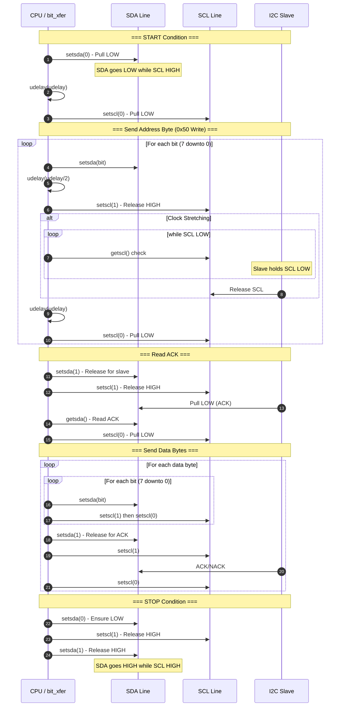

---

## 11. I2C Adapter驱动详解 - 树莓派BCM2835

树莓派使用Broadcom BCM2835/BCM2711 SoC，其中包含专用的I2C硬件控制器（BSC - Broadcom Serial Controller）。

### 11.1 BCM2835 I2C硬件架构

```
┌─────────────────────────────────────────────────────────────────────────────┐
│                    BCM2835 I2C Controller (BSC)                             │
└─────────────────────────────────────────────────────────────────────────────┘

┌─────────────────────────────────────────────────────────────────────────────┐
│                         BCM2835 SoC                                         │
│  ┌───────────────────────────────────────────────────────────────────────┐ │
│  │                      BSC (I2C Controller)                             │ │
│  │                                                                       │ │
│  │  ┌─────────────┐  ┌─────────────┐  ┌─────────────┐  ┌─────────────┐  │ │
│  │  │ Control Reg │  │ Status Reg  │  │ Data Length │  │  Address    │  │ │
│  │  │   (C)       │  │   (S)       │  │   (DLEN)    │  │   (A)       │  │ │
│  │  │ 0x7E804000  │  │ 0x7E804004  │  │ 0x7E804008  │  │ 0x7E80400C  │  │ │
│  │  └─────────────┘  └─────────────┘  └─────────────┘  └─────────────┘  │ │
│  │                                                                       │ │
│  │  ┌─────────────┐  ┌─────────────┐  ┌─────────────┐  ┌─────────────┐  │ │
│  │  │  FIFO Reg   │  │ Clock Div   │  │ Data Delay  │  │ Clock Tout  │  │ │
│  │  │   (FIFO)    │  │   (DIV)     │  │   (DEL)     │  │   (CLKT)    │  │ │
│  │  │ 0x7E804010  │  │ 0x7E804014  │  │ 0x7E804018  │  │ 0x7E80401C  │  │ │
│  │  └──────┬──────┘  └─────────────┘  └─────────────┘  └─────────────┘  │ │
│  │         │                                                             │ │
│  │         │  16-byte TX/RX FIFO                                        │ │
│  │         ▼                                                             │ │
│  │  ┌─────────────────────────────────────────────────────────────────┐ │ │
│  │  │                    I2C State Machine                            │ │ │
│  │  │  ┌─────────┐  ┌─────────┐  ┌─────────┐  ┌─────────┐            │ │ │
│  │  │  │  IDLE   │──│  START  │──│  ADDR   │──│  DATA   │──┐         │ │ │
│  │  │  └─────────┘  └─────────┘  └─────────┘  └─────────┘  │         │ │ │
│  │  │       ▲                                              │         │ │ │
│  │  │       └──────────────────┌─────────┐─────────────────┘         │ │ │
│  │  │                          │  STOP   │                           │ │ │
│  │  │                          └─────────┘                           │ │ │
│  │  └─────────────────────────────────────────────────────────────────┘ │ │
│  │                                                                       │ │
│  │                              │ IRQ                                    │ │
│  └──────────────────────────────┼────────────────────────────────────────┘ │
│                                 │                                          │
│                                 ▼                                          │
│                          ┌─────────────┐                                   │
│                          │  ARM Core   │                                   │
│                          └─────────────┘                                   │
└─────────────────────────────────────────────────────────────────────────────┘
          │                                │
          │ SDA                            │ SCL
          ▼                                ▼
    ┌─────────────────────────────────────────────────────┐
    │                    I2C Bus                          │
    │  ┌─────────┐  ┌─────────┐  ┌─────────┐             │
    │  │ Device  │  │ Device  │  │ Device  │             │
    │  │  0x50   │  │  0x68   │  │  0x76   │             │
    │  └─────────┘  └─────────┘  └─────────┘             │
    └─────────────────────────────────────────────────────┘
```

### 11.2 BCM2835寄存器定义

```c
// drivers/i2c/busses/i2c-bcm2835.c

/* Register offsets */
#define BCM2835_I2C_C       0x00    /* Control Register */
#define BCM2835_I2C_S       0x04    /* Status Register */
#define BCM2835_I2C_DLEN    0x08    /* Data Length Register */
#define BCM2835_I2C_A       0x0c    /* Slave Address Register */
#define BCM2835_I2C_FIFO    0x10    /* Data FIFO Register */
#define BCM2835_I2C_DIV     0x14    /* Clock Divider Register */
#define BCM2835_I2C_DEL     0x18    /* Data Delay Register */
#define BCM2835_I2C_CLKT    0x1c    /* Clock Stretch Timeout Register */

/* Control Register bits */
#define BCM2835_I2C_C_READ  BIT(0)  /* Read transfer */
#define BCM2835_I2C_C_CLEAR BIT(4)  /* Clear FIFO (bits 4 and 5) */
#define BCM2835_I2C_C_ST    BIT(7)  /* Start transfer */
#define BCM2835_I2C_C_INTD  BIT(8)  /* Interrupt on DONE */
#define BCM2835_I2C_C_INTT  BIT(9)  /* Interrupt on TX */
#define BCM2835_I2C_C_INTR  BIT(10) /* Interrupt on RX */
#define BCM2835_I2C_C_I2CEN BIT(15) /* I2C Enable */

/* Status Register bits */
#define BCM2835_I2C_S_TA    BIT(0)  /* Transfer Active */
#define BCM2835_I2C_S_DONE  BIT(1)  /* Transfer Done */
#define BCM2835_I2C_S_TXW   BIT(2)  /* FIFO needs Writing */
#define BCM2835_I2C_S_RXR   BIT(3)  /* FIFO needs Reading */
#define BCM2835_I2C_S_TXD   BIT(4)  /* FIFO can accept data */
#define BCM2835_I2C_S_RXD   BIT(5)  /* FIFO contains data */
#define BCM2835_I2C_S_TXE   BIT(6)  /* FIFO Empty */
#define BCM2835_I2C_S_RXF   BIT(7)  /* FIFO Full */
#define BCM2835_I2C_S_ERR   BIT(8)  /* ACK Error */
#define BCM2835_I2C_S_CLKT  BIT(9)  /* Clock Stretch Timeout */
```

### 11.3 驱动数据结构

```c
// drivers/i2c/busses/i2c-bcm2835.c

struct bcm2835_i2c_dev {
    struct device *dev;
    void __iomem *regs;             /* Memory-mapped registers */
    int irq;                        /* IRQ number */
    struct i2c_adapter adapter;     /* I2C adapter structure */
    struct completion completion;   /* Transfer completion */
    struct i2c_msg *curr_msg;       /* Current message being processed */
    struct clk *bus_clk;            /* I2C bus clock */
    int num_msgs;                   /* Number of messages remaining */
    u32 msg_err;                    /* Error flags */
    u8 *msg_buf;                    /* Current buffer pointer */
    size_t msg_buf_remaining;       /* Bytes remaining in buffer */
};
```

### 11.4 BCM2835传输流程

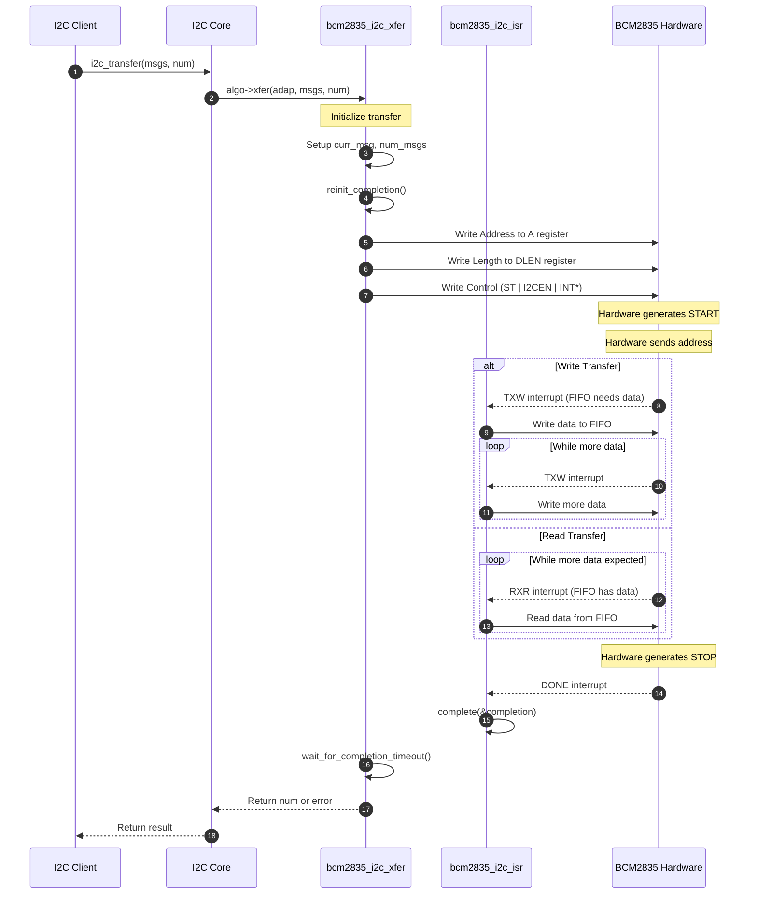

### 11.5 关键函数实现

#### 11.5.1 启动传输

```c
// drivers/i2c/busses/i2c-bcm2835.c

static void bcm2835_i2c_start_transfer(struct bcm2835_i2c_dev *i2c_dev)
{
    u32 c = BCM2835_I2C_C_ST | BCM2835_I2C_C_I2CEN;
    struct i2c_msg *msg = i2c_dev->curr_msg;
    bool last_msg = (i2c_dev->num_msgs == 1);

    if (!i2c_dev->num_msgs)
        return;

    i2c_dev->num_msgs--;
    i2c_dev->msg_buf = msg->buf;
    i2c_dev->msg_buf_remaining = msg->len;

    /* Configure for read or write */
    if (msg->flags & I2C_M_RD)
        c |= BCM2835_I2C_C_READ | BCM2835_I2C_C_INTR;  /* Read + RX interrupt */
    else
        c |= BCM2835_I2C_C_INTT;  /* Write + TX interrupt */

    /* Enable DONE interrupt for last message */
    if (last_msg)
        c |= BCM2835_I2C_C_INTD;

    /* Write registers and start transfer */
    bcm2835_i2c_writel(i2c_dev, BCM2835_I2C_A, msg->addr);
    bcm2835_i2c_writel(i2c_dev, BCM2835_I2C_DLEN, msg->len);
    bcm2835_i2c_writel(i2c_dev, BCM2835_I2C_C, c);
}
```

#### 11.5.2 中断处理

```c
// drivers/i2c/busses/i2c-bcm2835.c

static irqreturn_t bcm2835_i2c_isr(int this_irq, void *data)
{
    struct bcm2835_i2c_dev *i2c_dev = data;
    u32 val, err;

    /* Read status register */
    val = bcm2835_i2c_readl(i2c_dev, BCM2835_I2C_S);

    /* Check for errors (ACK error or clock timeout) */
    err = val & (BCM2835_I2C_S_CLKT | BCM2835_I2C_S_ERR);
    if (err && !(val & BCM2835_I2C_S_TA))
        i2c_dev->msg_err = err;

    /* Transfer complete */
    if (val & BCM2835_I2C_S_DONE) {
        if (i2c_dev->curr_msg->flags & I2C_M_RD)
            bcm2835_drain_rxfifo(i2c_dev);
        goto complete;
    }

    /* TX FIFO needs more data */
    if (val & BCM2835_I2C_S_TXW) {
        bcm2835_fill_txfifo(i2c_dev);
        
        /* Start next message if current is done */
        if (i2c_dev->num_msgs && !i2c_dev->msg_buf_remaining) {
            i2c_dev->curr_msg++;
            bcm2835_i2c_start_transfer(i2c_dev);
        }
        return IRQ_HANDLED;
    }

    /* RX FIFO has data */
    if (val & BCM2835_I2C_S_RXR) {
        bcm2835_drain_rxfifo(i2c_dev);
        return IRQ_HANDLED;
    }

    return IRQ_NONE;

complete:
    /* Clear status and signal completion */
    bcm2835_i2c_writel(i2c_dev, BCM2835_I2C_C, BCM2835_I2C_C_CLEAR);
    bcm2835_i2c_writel(i2c_dev, BCM2835_I2C_S, 
                       BCM2835_I2C_S_CLKT | BCM2835_I2C_S_ERR | BCM2835_I2C_S_DONE);
    complete(&i2c_dev->completion);
    return IRQ_HANDLED;
}
```

#### 11.5.3 FIFO操作

```c
// drivers/i2c/busses/i2c-bcm2835.c

/* Fill TX FIFO with data to send */
static void bcm2835_fill_txfifo(struct bcm2835_i2c_dev *i2c_dev)
{
    u32 val;

    while (i2c_dev->msg_buf_remaining) {
        val = bcm2835_i2c_readl(i2c_dev, BCM2835_I2C_S);
        if (!(val & BCM2835_I2C_S_TXD))  /* FIFO full? */
            break;
        bcm2835_i2c_writel(i2c_dev, BCM2835_I2C_FIFO,
                           *i2c_dev->msg_buf);
        i2c_dev->msg_buf++;
        i2c_dev->msg_buf_remaining--;
    }
}

/* Drain RX FIFO into receive buffer */
static void bcm2835_drain_rxfifo(struct bcm2835_i2c_dev *i2c_dev)
{
    u32 val;

    while (i2c_dev->msg_buf_remaining) {
        val = bcm2835_i2c_readl(i2c_dev, BCM2835_I2C_S);
        if (!(val & BCM2835_I2C_S_RXD))  /* FIFO empty? */
            break;
        *i2c_dev->msg_buf = bcm2835_i2c_readl(i2c_dev,
                                              BCM2835_I2C_FIFO);
        i2c_dev->msg_buf++;
        i2c_dev->msg_buf_remaining--;
    }
}
```

### 11.6 驱动探测和注册

```c
// drivers/i2c/busses/i2c-bcm2835.c

/* Algorithm definition */
static const struct i2c_algorithm bcm2835_i2c_algo = {
    .xfer = bcm2835_i2c_xfer,
    .functionality = bcm2835_i2c_func,
};

/* Known hardware quirks */
static const struct i2c_adapter_quirks bcm2835_i2c_quirks = {
    .flags = I2C_AQ_NO_CLK_STRETCH,  /* Clock stretching has issues */
};

static int bcm2835_i2c_probe(struct platform_device *pdev)
{
    struct bcm2835_i2c_dev *i2c_dev;
    struct i2c_adapter *adap;
    int ret;
    u32 bus_clk_rate;

    /* Allocate driver data */
    i2c_dev = devm_kzalloc(&pdev->dev, sizeof(*i2c_dev), GFP_KERNEL);
    if (!i2c_dev)
        return -ENOMEM;

    /* Get and map registers */
    i2c_dev->regs = devm_platform_get_and_ioremap_resource(pdev, 0, NULL);
    if (IS_ERR(i2c_dev->regs))
        return PTR_ERR(i2c_dev->regs);

    /* Setup clock */
    mclk = devm_clk_get(&pdev->dev, NULL);
    i2c_dev->bus_clk = bcm2835_i2c_register_div(&pdev->dev, mclk, i2c_dev);
    
    /* Get clock frequency from device tree (default 100kHz) */
    of_property_read_u32(pdev->dev.of_node, "clock-frequency", &bus_clk_rate);
    clk_set_rate_exclusive(i2c_dev->bus_clk, bus_clk_rate);
    clk_prepare_enable(i2c_dev->bus_clk);

    /* Setup IRQ */
    i2c_dev->irq = platform_get_irq(pdev, 0);
    request_irq(i2c_dev->irq, bcm2835_i2c_isr, IRQF_SHARED,
                dev_name(&pdev->dev), i2c_dev);

    /* Setup and register adapter */
    adap = &i2c_dev->adapter;
    i2c_set_adapdata(adap, i2c_dev);
    adap->owner = THIS_MODULE;
    snprintf(adap->name, sizeof(adap->name), "bcm2835 (%s)",
             of_node_full_name(pdev->dev.of_node));
    adap->algo = &bcm2835_i2c_algo;
    adap->dev.parent = &pdev->dev;
    adap->dev.of_node = pdev->dev.of_node;
    adap->quirks = of_device_get_match_data(&pdev->dev);

    return i2c_add_adapter(adap);
}

/* Device tree matching */
static const struct of_device_id bcm2835_i2c_of_match[] = {
    { .compatible = "brcm,bcm2711-i2c" },
    { .compatible = "brcm,bcm2835-i2c", .data = &bcm2835_i2c_quirks },
    {},
};

static struct platform_driver bcm2835_i2c_driver = {
    .probe      = bcm2835_i2c_probe,
    .remove_new = bcm2835_i2c_remove,
    .driver     = {
        .name   = "i2c-bcm2835",
        .of_match_table = bcm2835_i2c_of_match,
    },
};
module_platform_driver(bcm2835_i2c_driver);
```

### 11.7 BCM2835 vs Bit-Bang对比

| 特性 | BCM2835 硬件控制器 | Bit-Bang (GPIO) |
|------|-------------------|-----------------|
| **CPU占用** | 低（中断驱动） | 高（轮询延时） |
| **速度** | 高达400kHz+ | 通常<100kHz |
| **时序精度** | 硬件保证 | 依赖软件延时 |
| **FIFO** | 16字节硬件FIFO | 无 |
| **Clock Stretching** | 有限支持（有bug） | 支持（getscl） |
| **多主机仲裁** | 硬件支持 | 需软件实现 |
| **引脚** | 专用I2C引脚 | 任意GPIO |
| **调试难度** | 较难（硬件封装） | 较易（可逐步调试） |

### 11.8 树莓派I2C设备树配置示例

```dts
// arch/arm/boot/dts/broadcom/bcm2835-common.dtsi

i2c0: i2c@7e205000 {
    compatible = "brcm,bcm2835-i2c";
    reg = <0x7e205000 0x200>;
    interrupts = <2 21>;
    clocks = <&clocks BCM2835_CLOCK_VPU>;
    #address-cells = <1>;
    #size-cells = <0>;
    status = "disabled";
};

i2c1: i2c@7e804000 {
    compatible = "brcm,bcm2835-i2c";
    reg = <0x7e804000 0x1000>;
    interrupts = <2 21>;
    clocks = <&clocks BCM2835_CLOCK_VPU>;
    #address-cells = <1>;
    #size-cells = <0>;
    status = "disabled";
};

/* Example device node */
&i2c1 {
    status = "okay";
    clock-frequency = <100000>;  /* 100kHz standard mode */
    
    eeprom@50 {
        compatible = "atmel,24c32";
        reg = <0x50>;
    };
    
    rtc@68 {
        compatible = "dallas,ds1307";
        reg = <0x68>;
    };
};
```

---

## 12. 算法与适配器对比总结

### 12.1 不同类型I2C实现对比

```
┌─────────────────────────────────────────────────────────────────────────────┐
│                   I2C Implementation Comparison                              │
└─────────────────────────────────────────────────────────────────────────────┘

┌───────────────────┬───────────────────┬───────────────────┬─────────────────┐
│     Type          │   Bit-Bang        │  Hardware Ctrl    │  State Machine  │
│                   │   (i2c-gpio)      │  (i2c-bcm2835)    │  (i2c-algo-pca) │
├───────────────────┼───────────────────┼───────────────────┼─────────────────┤
│                   │                   │                   │                 │
│   CPU in loop     │     ┌─────┐      │    ┌─────┐       │    ┌─────┐      │
│                   │     │ CPU │──┐   │    │ CPU │       │    │ CPU │       │
│                   │     └─────┘  │   │    └──┬──┘       │    └──┬──┘       │
│                   │        │     │   │       │          │       │          │
│                   │        ▼     │   │       │ IRQ      │       │ Read/    │
│   GPIO Control    │     ┌─────┐ │   │       │          │       │ Write    │
│                   │     │ GPIO│ │   │       ▼          │       ▼          │
│                   │     └──┬──┘ │   │    ┌──────┐      │    ┌──────┐      │
│                   │        │    │   │    │ I2C  │      │    │PCA   │      │
│   I2C Lines       │        │    │   │    │ HW   │      │    │9564  │      │
│                   │     ┌──┴──┐ │   │    │ Ctrl │      │    │9665  │      │
│                   │     │ SDA │◄┘   │    └──┬───┘      │    └──┬───┘      │
│                   │     │ SCL │     │       │          │       │          │
│                   │     └─────┘     │       ▼          │       ▼          │
│                   │                 │    ┌─────┐       │    ┌─────┐       │
│                   │                 │    │ SDA │       │    │ SDA │       │
│                   │                 │    │ SCL │       │    │ SCL │       │
│                   │                 │    └─────┘       │    └─────┘       │
│                   │                 │                   │                 │
├───────────────────┼───────────────────┼───────────────────┼─────────────────┤
│ Algorithm File    │ i2c-algo-bit.c    │ Built-in algo    │ i2c-algo-pca.c  │
│ Adapter File      │ i2c-gpio.c        │ i2c-bcm2835.c    │ i2c-pca-*.c     │
│ Timing Control    │ udelay()          │ Clock divider    │ Hardware regs   │
│ Transfer Model    │ Synchronous       │ IRQ + completion │ State polling   │
│ Speed             │ ~100kHz max       │ Up to 400kHz+    │ Up to 400kHz    │
└───────────────────┴───────────────────┴───────────────────┴─────────────────┘
```

### 12.2 选择指南

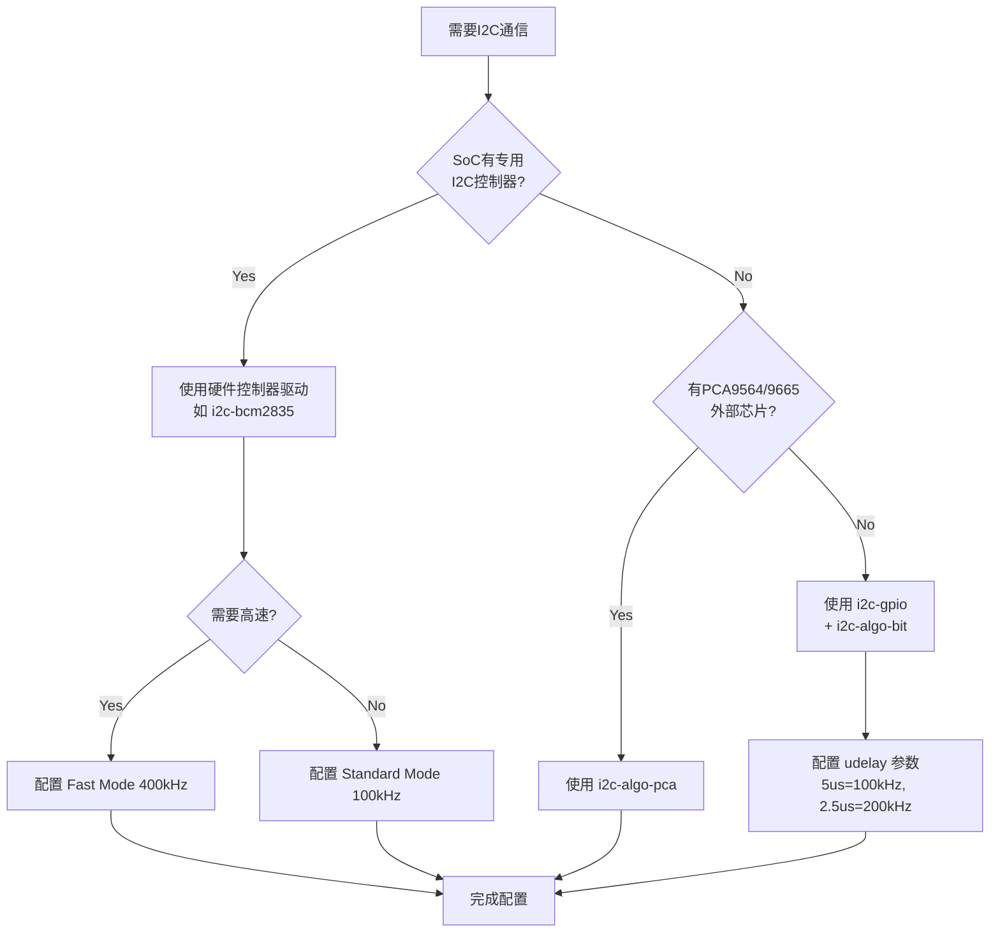

---

*文档基于 Linux 内核源码分析生成*
*最后更新: 2026-01-06*
